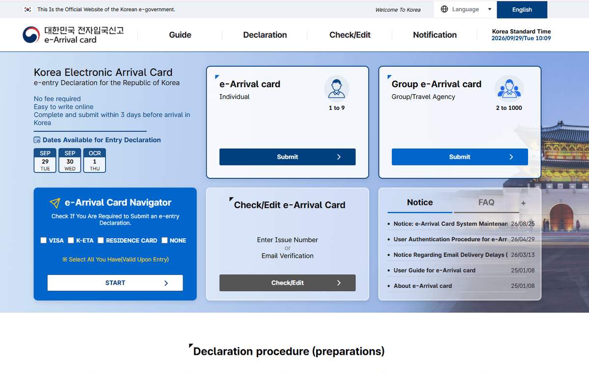
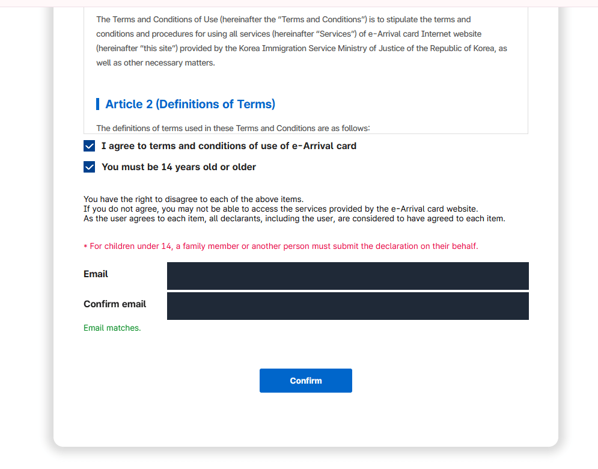
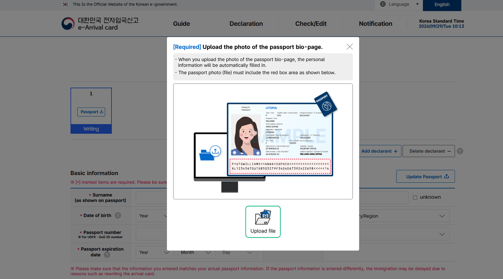
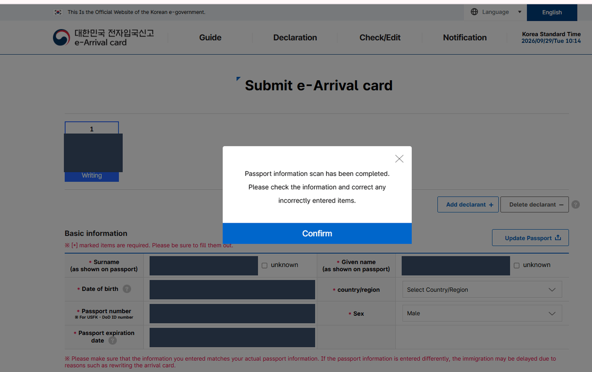
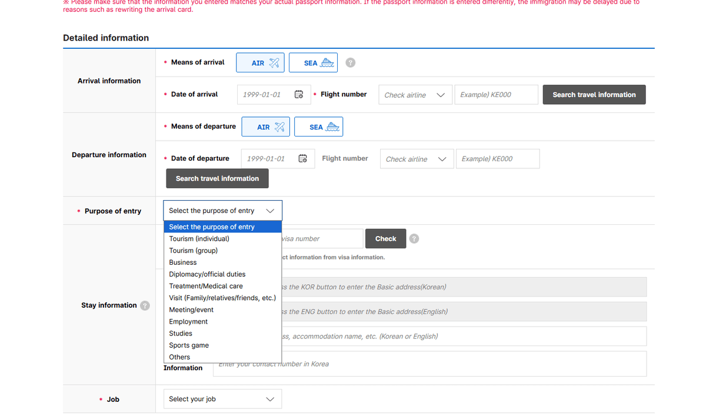
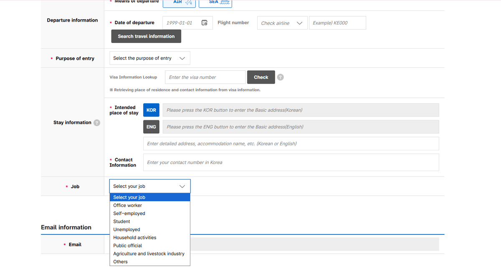
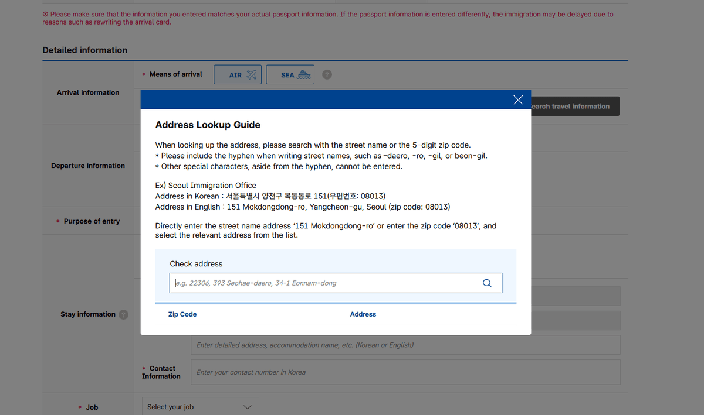

Korea's e-Arrival Card is the electronic replacement for the paper arrival
card. It is free, it is filled in online before you fly, and the part that
catches people is not any of the fields.

It is this: **being exempt from K-ETA does not exempt you from this form.** It
puts you on the list of people who have to file it.

<div class="callout callout-warn">
  <p class="callout-title">⚠️ The one that catches everyone</p>
  <p>On the official list of people <strong>subject to</strong> the declaration, entry 02 is “K-ETA exempt individuals”. On the list of people <strong>excluded</strong> from it, entry 03 is “K-ETA holders”. Those are not the same group — they are opposites. The exclusion rides on an <em>approved</em> K-ETA, so a waiver that means you never applied for one leaves nothing to carry it.</p>
</div>

## Before you start: you are on the right site

The homepage opens with its own fraud warning. Fake sites impersonating the
service have been found, and the official one is `www.e-arrivalcard.go.kr` and
nothing else. The tell is money:

<div class="callout callout-note">
  <p class="callout-title">The test</p>
  <p>There is no fee. Any site asking for payment information is not the official service — that is the official site's own wording, not ours.</p>
</div>



<p class="figcap">Two ways in — <strong>Individual</strong> for 1 to 9 people, <strong>Group/Travel Agency</strong> for 2 to 1000. The dates panel on the left is the three-day window.</p>

The homepage also shows the dates it will currently accept. On 29 September it
listed 29 September, 30 September and 1 October: the arrival day plus the two
after it. Within three days of arrival, in other words — this is not something
you can file when you book.



<p class="figcap">The email goes in twice and the screen prints <strong>“Email matches.”</strong> when they agree. The red line above it is the one families need: under 14, somebody else files.</p>

## The eleven screens, in order

<div class="steps">
  <div class="step"><div class="step-num">1</div><div class="step-body"><strong>Pick Individual.</strong> Two cards on the homepage: <em>e-Arrival card — Individual</em>, 1 to 9 people, and <em>Group/Travel Agency</em>, 2 to 1000. A family travelling together goes through Individual and uses <em>Add declarant</em> inside the form.</div></div>
  <div class="step"><div class="step-num">2</div><div class="step-body"><strong>Consent, then email twice.</strong> <em>Agree to all</em> ticks the personal-information consent and the terms together. Enter your email in both boxes; the screen prints “Email matches.” when they agree.</div></div>
  <div class="step"><div class="step-num">3</div><div class="step-body"><strong>Upload the passport bio-page.</strong> Marked Required. The photo has to show the whole page including the machine-readable zone at the bottom.</div></div>
  <div class="step"><div class="step-num">4</div><div class="step-body"><strong>Check what the scan filled in.</strong> “Passport information scan has been completed. Please check the information and correct any incorrectly entered items.”</div></div>
  <div class="step"><div class="step-num">5</div><div class="step-body"><strong>Arrival: AIR or SEA, date, flight number.</strong> The airline is chosen from a searchable list, then the number — <code>KE000</code> is the example given.</div></div>
  <div class="step"><div class="step-num">6</div><div class="step-body"><strong>Departure: the same three fields again.</strong> The departure date is a required item; the departure flight number is optional.</div></div>
  <div class="step"><div class="step-num">7</div><div class="step-body"><strong>Purpose of entry.</strong> Eleven options, listed below.</div></div>
  <div class="step"><div class="step-num">8</div><div class="step-body"><strong>Visa Information Lookup, if you have a visa.</strong> Enter the visa number and press Check; the site pulls your place of residence and contact details from the visa record.</div></div>
  <div class="step"><div class="step-num">9</div><div class="step-body"><strong>Korean address.</strong> Search by street name or five-digit postcode, then add the hotel name or unit in the detail box.</div></div>
  <div class="step"><div class="step-num">10</div><div class="step-body"><strong>A contact number in Korea, and your job.</strong> Eight job options, listed below.</div></div>
  <div class="step"><div class="step-num">11</div><div class="step-body"><strong>Submit.</strong> Your email is shown again at the foot of the page above the button.</div></div>
</div>



<p class="figcap">The red box on the sample is the instruction: the <strong>whole</strong> bio page, machine-readable zone included. Crop it out and the scan has nothing to read.</p>

## What the form treats as required

The consent screen lists it outright, which is useful because it tells you what
to have in front of you before you open the form.

```
REQUIRED                           OPTIONAL
─────────────────────────────      ─────────────────────────────
Email                              Departure flight number
Nationality                          (or ship name)
Gender                             Previous place of departure
Name                               Next destination
Date of birth                      Visa information
Passport number                    DoD ID number (USFK)
Passport expiration date
Occupation
Residence information
Purpose of entry
Date of entry
Arrival flight number (or ship)
Departure date
```

Retention of the collected data is shown as semi-permanent.

## Under 14: somebody else files for you

The terms screen carries two checkboxes — agreement to the terms, and "You must
be 14 years old or older" — and then the line that matters for families:

<div class="callout callout-note">
  <p class="callout-title">Children</p>
  <p>For a child under 14, a family member or another person has to submit the declaration on their behalf. The child cannot be the declarant.</p>
</div>

## The passport upload does not finish the job

Upload the bio-page and the site reads it: surname, given name, date of birth,
passport number, expiry date and sex all come back filled in. Then it tells you
to check them.



<p class="figcap">Read the row on the right: <strong>country/region is still “Select Country/Region”</strong> while everything else came back filled. Personal values are masked here.</p>

That instruction is worth taking literally. In our run the scan populated the
name and passport fields but left **country/region** as "Select Country/Region"
— an unfilled dropdown in the middle of a form that otherwise looks finished.
The country list is a searchable A-to-Z, so it is a ten-second fix, but only if
you notice it.

The page also carries a red warning under the basic information block: if the
passport details you submit differ from your actual passport, immigration can
be delayed while the card is rewritten. The scan is a convenience, not a
verification.

## Purpose of entry — the eleven options

This is the dropdown people guess at. The exact wording:

```
Tourism (Individual)          Meeting/event
Tourism (group)               Employment
Business                      Studies
Diplomacy/Official duties     Sports game
Treatment/Medical care        Others
Visit (Family/relatives/friends, etc.)
```



<p class="figcap">All eleven, as worded on the form.</p>

Two notes. **Business** and **Meeting/event** are separate entries, so a work
trip is not automatically "Business" — a conference or a trade event has its
own option. And **Visit (Family/relatives/friends, etc.)** exists, so seeing
relatives is not "Tourism".

<div class="callout callout-warn">
  <p class="callout-title">⚠️ This box is not where your entry route is decided</p>
  <p>Picking “Business” here does not grant you anything, and picking “Tourism” does not protect you. Whether a short business visit is inside visa-free entry is settled before you reach this form — the visa-free purposes are travel, visiting relatives, attending events or conferences, and business purposes with <em>no commercial activities allowed</em>. The line is the commercial activity, not the word.</p>
</div>

## Job — the eight options

```
Office worker                 Household activities
Self-employed                 Public official
Student                       Agriculture and livestock industry
Unemployed                    Others
```



<p class="figcap">One screen holds the three fields that stall people: the <strong>visa lookup</strong>, the <strong>KOR / ENG</strong> address buttons, and <strong>Job</strong>.</p>

There is no "retired" and no "freelancer". Most readers land on Office worker,
Self-employed or Student.

## The Korean address is the field that stalls people

The address box has two buttons — **KOR** and **ENG** — and each opens a
lookup. The English one comes with a guide, and its rules are specific:

<div class="check-card">
  <div class="check-row ok"><span class="mark"></span><span>Search by <strong>street name</strong> or by <strong>five-digit postcode</strong>.</span></div>
  <div class="check-row ok"><span class="mark"></span><span>Keep the hyphens in romanised street names — <code>-ro</code>, <code>-gil</code>, <code>-daero</code>, <code>-beon-gil</code>.</span></div>
  <div class="check-row miss"><span class="mark"></span><span>No other special characters. The box rejects them.</span></div>
</div>

The site's own worked example, using a building anyone can look up:


<p class="figcap">The guide the <strong>ENG</strong> button opens, with its own worked example.</p>


```
Korean    서울특별시 양천구 목동동로 151 (신월동, 08013)
English   151 Mokdongdong-ro, Yangcheon-gu, Seoul   zip 08013

Search either  "151 Mokdongdong-ro"   or   "08013"
then pick the matching address from the list.
```

Once the base address is in, the second box takes the rest: **"Enter detailed
address, accommodation name, etc."** — the hotel name, the unit number, the
floor. Korean or English both accepted.

For a hotel, search the hotel's street address and put the hotel name in the
detail box. For an Airbnb or a friend's place, use the address you will
actually sleep at.

## Where this sits among the four things people confuse

<figure class="figure hero">
  <p class="figure-title">Four questions, four answers</p>
  <p class="figure-sub">They are decided separately, and in this order</p>

```
Visa-free entry   Can you enter without a visa, and for how long?
      ↓
K-ETA             If entering without a visa, is prior authorisation needed?
      ↓
Visa              If not visa-free, which visa matches the purpose?
      ↓
e-Arrival Card    Whatever the answer above, do you file this declaration?
```

</figure>

The last one does not follow from the others. It is decided by what you
actually enter on:

| You enter on | e-Arrival Card |
| --- | --- |
| An approved K-ETA | Excluded |
| A Korean Residence Card | Excluded |
| A group (electronic) visa | Excluded |
| A Korean visa | **File it** |
| A K-ETA you hold, but a visa you enter on | **File it** |
| A K-ETA exemption (country waiver, age, diplomatic passport) | **File it** |
| A valid ABTC | **File it** |

The official site's own navigator makes the same point in its wording: it asks
you to select what you have **"used upon entry"**, not what you hold.

<div class="callout callout-note">
  <p class="callout-title">Not sure which row is you?</p>
  <p>The <a href="/tools/korea-entry-check/">Korea entry requirements check</a> answers the three separately — visa-free scope and how long you get, whether K-ETA applies, and whether you file this — and links the official page each answer was read from.</p>
  <p>If the answer is that you need a K-ETA, <a href="/visas/how-to-apply-for-k-eta-step-by-step/">the application walkthrough</a> covers the screens, including the two warnings that decide whether it goes through first time.</p>
</div>

## Before you press Submit

<div class="check-card">
  <div class="check-row ok"><span class="mark"></span><span><strong>Passport number and expiry</strong> against the passport itself, not against the scan.</span></div>
  <div class="check-row ok"><span class="mark"></span><span><strong>Name spelling</strong> exactly as printed, surname and given name in the right boxes.</span></div>
  <div class="check-row ok"><span class="mark"></span><span><strong>Country/region</strong> — the field the scan is most likely to have left empty.</span></div>
  <div class="check-row ok"><span class="mark"></span><span><strong>Arrival date and flight number</strong>, and the departure date.</span></div>
  <div class="check-row ok"><span class="mark"></span><span><strong>The Korean address</strong>, with the accommodation name in the detail box.</span></div>
</div>

If something is wrong after submission, the homepage has a **Check/Edit**
panel: enter the issue number, or verify by email.

## The short version

Free, on the official site only, within three days of arrival. The passport
upload does most of the typing and none of the checking. The two fields that
actually cost people time are the Korean address and the country/region the
scan skipped.

And the thing worth carrying away: a K-ETA exemption is not an e-Arrival
exemption. It is the reason you are filing.
