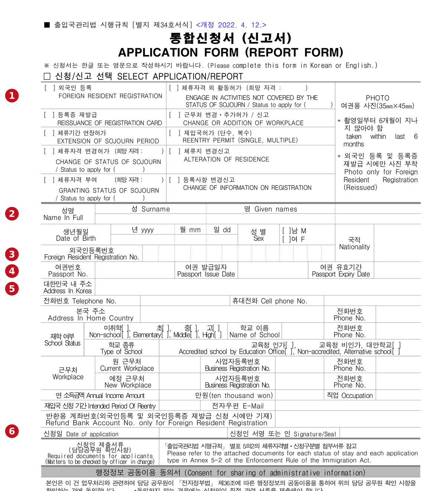
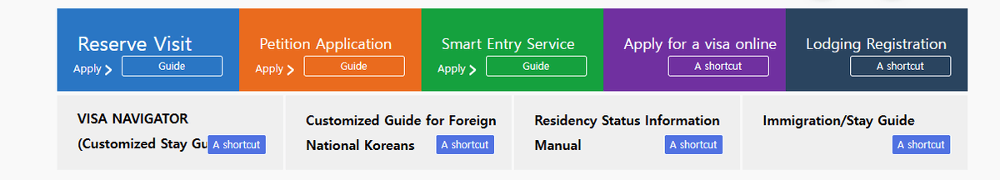
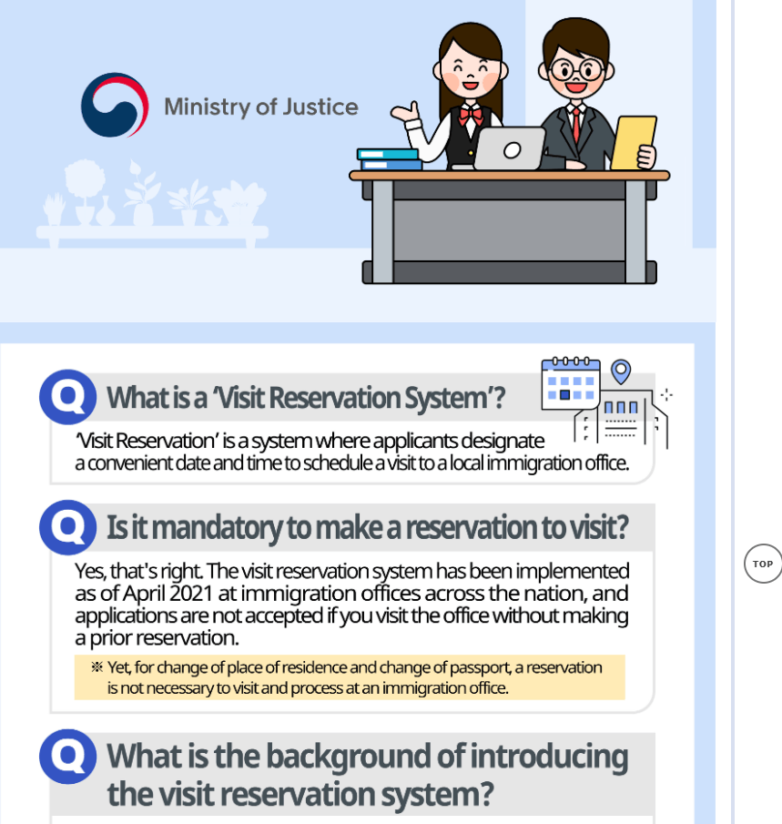
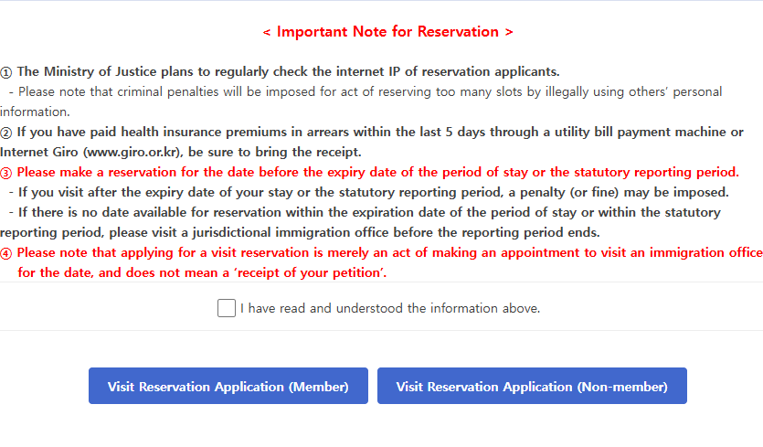
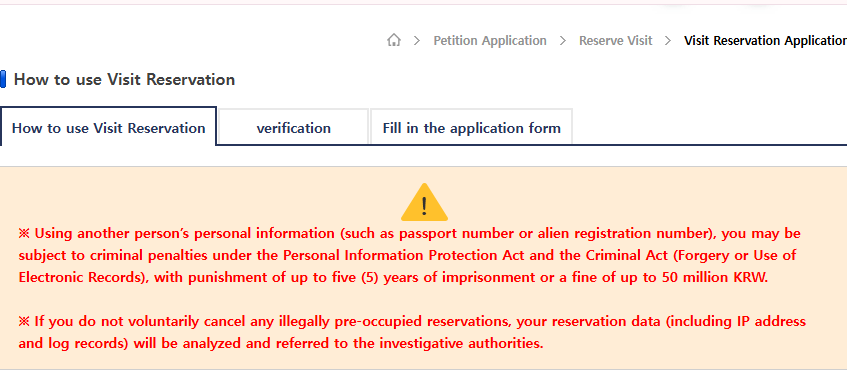
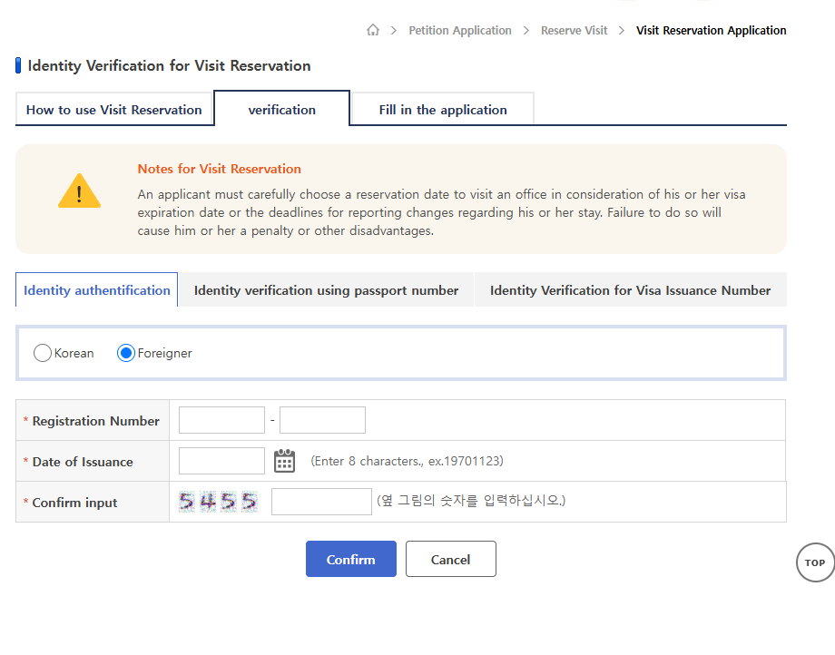
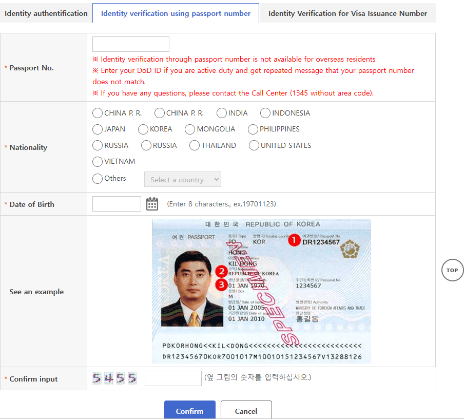
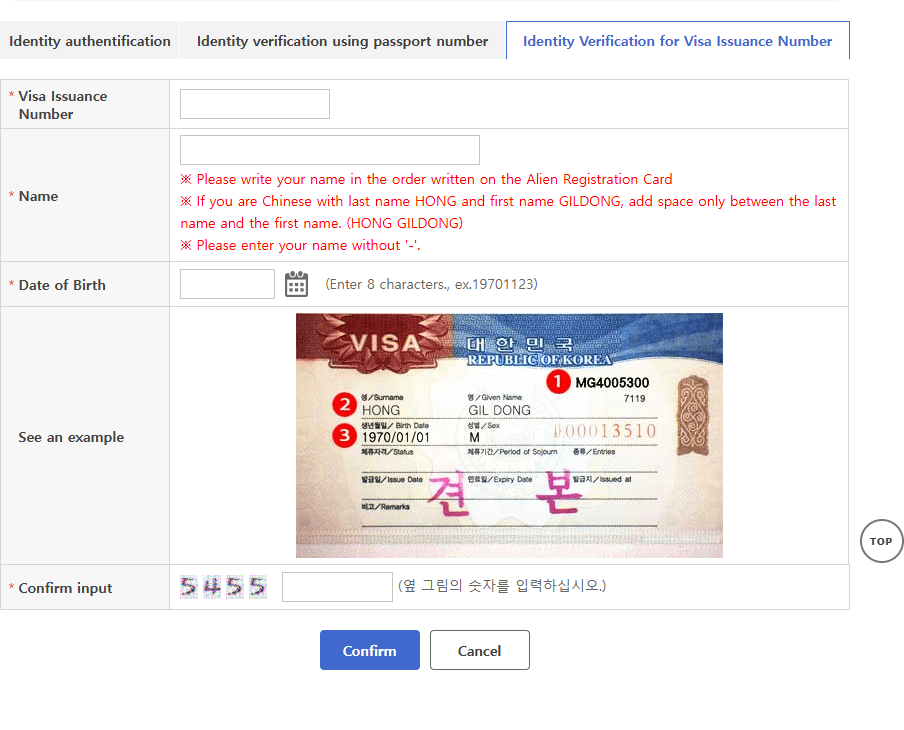
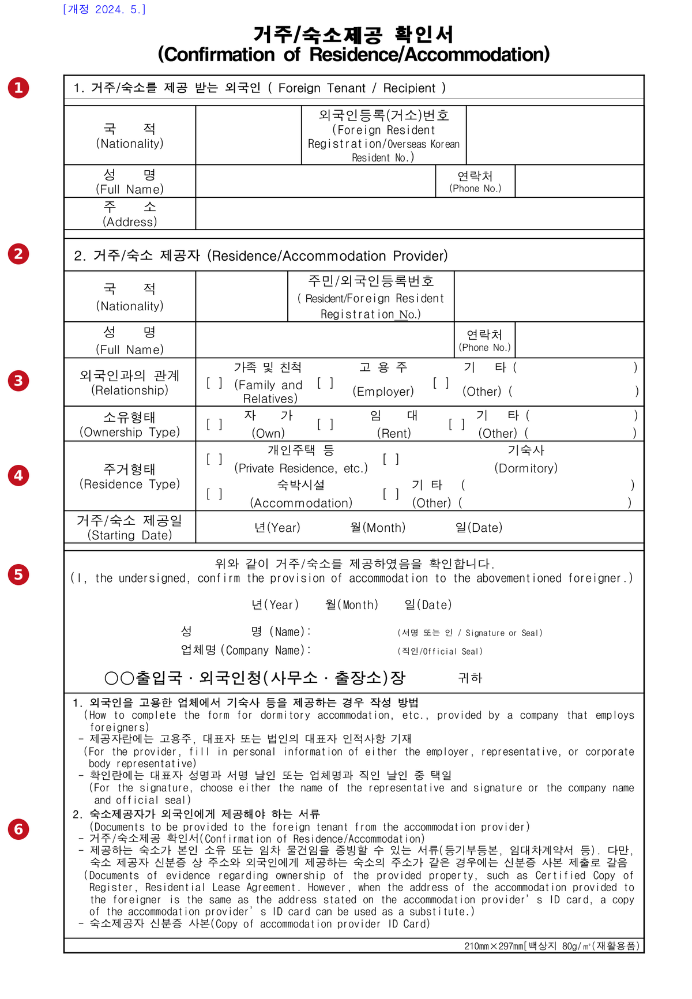

Getting your visa is the first step, not the last one. A visa is permission to
enter Korea under a particular status. **Foreign resident registration** is a
separate procedure, done after you arrive, that records your long-term
residence and ties your passport, status of stay and Korean address into the
immigration system.

<figure class="figure hero">
  
Three things people get wrong

  
All three are stated on the government's own screens

  

    
A HiKorea booking is <strong>not</strong> your application. The page says so: it "does not mean a 'receipt of your petition'".

    
No slot before your deadline does <strong>not</strong> move the deadline. You are told to go to the office anyway.

    
And two things need <strong>no booking at all</strong> — a change of residence and a change of passport.

  

  
Everything below is the procedure those three facts sit inside.

</figure>

## The 90-day clock, and why it is not a three-month grace period

The 2026 sojourn manual applies the same rule across statuses: a person
intending to stay **90 days or longer** must complete foreign registration
**within 90 days of the date of entry**. The manual states it plainly in the
general notice to applicants, and repeats it in the status-specific procedures
— for F-1 visiting and F-3 accompanying family, for example, it appears as the
first line of the residence-management steps.

Exemptions and status-specific rules exist, so the first thing to check is
whether your own status requires registration at all. But if it does, treat 90
days as the outer limit rather than the plan. The sequence that works is:

    enter Korea → settle your address → check your status documents →
    book the office visit → prepare Form 34 → attend → register

The reason to book early is not politeness. A HiKorea reservation is an
appointment, and appointments run out.

## Form 34 is ten different applications

The form you will fill in is the **Integrated Application Form (Report Form)**,
Form No. 34 under the Enforcement Rule of the Immigration Act, revised 12 April
2022. It can be completed in Korean or English.

Open it and the first thing to do is choose which application it is. There are
ten boxes, and only the first is first-time registration:

| The box | What it is |
| --- | --- |
| **Foreign Resident Registration** | First-time registration — the one this guide is about |
| Reissuance of Registration Card | A replacement card |
| Extension of Sojourn Period | More time on the status you hold |
| Change of Status of Sojourn | A different status |
| Granting Status of Sojourn | Being given a status you did not enter on |
| Engage in Activities Not Covered by the Status of Sojourn | Permission to do something your status does not cover |
| Change or Addition of Workplace | A new or additional employer |
| Reentry Permit (Single, Multiple) | Leaving and coming back |
| Alteration of Residence | You moved |
| Change of Information on Registration | Your name, passport or nationality changed |

Tick the wrong one and you have filed something you did not mean to file.

<strong>①</strong> The box to tick — Foreign Resident Registration, first of the ten. <strong>②</strong> Name in full, spelled exactly as your passport spells it. <strong>③</strong> Foreign Resident Registration No. — you do not have one yet, so this stays empty on a first application. <strong>④</strong> Passport number, issue date and expiry date. <strong>⑤</strong> Address in Korea — the one your proof of residence has to match. <strong>⑥</strong> Date and signature. The markers are ours, in the gutter; nothing on the form has been altered or filled in.

The form also asks for telephone and mobile number, your address in your home
country, school status, workplace and business registration number, annual
income, occupation, email, and — for registration and card reissuance only — a
refund bank account number. Applicants with a job or a school place should have
those details to hand before they start.

  
The photo rule, and a translation that trips people up

  
The photo panel asks for a passport-style photo, <strong>35mm × 45mm</strong>, taken within the last six months. Its English line reads "Photo only for Foreign Resident Registration (Reissued)", which is easy to read as <em>reissues only</em>. The Korean says 외국인 등록 <strong>및</strong> 등록증 재발급 — registration <strong>and</strong> card reissuance. Bring the photo for a first registration.

## Step 1 — HiKorea, and the tile you are looking for

Booking the office visit happens on HiKorea. On the English home page the
service panel carries **Reserve Visit** first, alongside Petition Application,
Smart Entry Service and the rest.

Reserve Visit → Apply. You do not start from the visa section — that stage is over.

## What a Visit Reservation actually is

The Ministry of Justice guidance defines it in one line, and then answers the
question everyone actually has:

> **Is it mandatory to make a reservation to visit?**
>
> Yes, that's right. The visit reservation system has been implemented as of
> April 2021 at immigration offices across the nation, and applications are not
> accepted if you visit the office without making a prior reservation.

Note the yellow line under the answer. It is the part most guides leave out.

That yellow line is the exception, and it is worth knowing before you spend an
afternoon hunting for a slot:

> ※ Yet, for change of place of residence and change of passport, a reservation
> is not necessary to visit and process at an immigration office.

So the rule is "book first" for registration, extension, status change and the
rest — but if you have moved house or replaced your passport, you can go.

## The warnings on the booking page are not boilerplate

Before the booking form, HiKorea puts up an **Important Note for Reservation**.
Four numbered points, two of them in red.

The red points are the two that cost people money. Below them, the member and non-member routes.

The third point is the deadline one:

> ③ Please make a reservation for the date before the expiry date of the period
> of stay or the statutory reporting period.
>
> – If you visit after the expiry date of your stay or the statutory reporting
> period, a penalty (or fine) may be imposed.
>
> – If there is no date available for reservation within the expiration date of
> the period of stay or within the statutory reporting period, please visit a
> jurisdictional immigration office before the reporting period ends.

Read the second dash twice. "There was no appointment" is not a defence, and
the instruction when the calendar is full is to turn up anyway.

The fourth point is the one that catches first-timers:

> ④ Please note that applying for a visit reservation is merely an act of
> making an appointment to visit an immigration office for the date, and does
> not mean a 'receipt of your petition'.

  
Do not book with someone else's details

  
The reservation guide warns that using another person's personal information — a passport number or an alien registration number — can bring criminal penalties under the Personal Information Protection Act and the Criminal Act, with up to five years' imprisonment or a fine of up to 50 million KRW. It also says the Ministry checks the IP addresses of reservation applicants, and that reservation data from illegally pre-occupied slots is analysed and referred to the investigative authorities.

On the reservation guide itself, above the fold.

## Member or non-member

HiKorea offers both: **Visit Reservation Application (Member)** and **Visit
Reservation Application (Non-member)**. An account is not the only route, which
matters if you landed last week and have not built a Korean online identity
yet.

## Choosing the right identity-verification tab

This is where a first-time applicant most often gets stuck. The non-member
route offers three verification methods, on three tabs, and the default is the
wrong one for you.

The default tab asks for a **Registration Number** and a date of issuance —
which assumes you already hold a Korean foreign resident registration number.

Fine for a renewal. Useless on a first application, because the number it wants is the one you are applying for.

The second tab is the one to use. **Identity verification using passport
number** asks for your passport number, nationality, date of birth and the
verification code.

The specimen is HiKorea's own, stamped SPECIMEN and made out to 홍길동 — Korea's John Doe. Its red ①②③ mark the three fields you copy: passport number, nationality, date of birth.

Two details on that screen are worth reading before you type. It states that
**passport-number verification is not available for overseas residents** — one
more reason this is a post-arrival procedure. And it tells active-duty
applicants to enter their DoD ID if the passport number keeps coming back as
not matching.

The third tab, **Identity Verification for Visa Issuance Number**, exists for
applicants who have that number and want to authenticate with it. It asks for
the number, your name and your date of birth.

Not everyone uses this route. Note the naming instruction: write your name in the order shown on the Alien Registration Card, with no hyphen.

The point is not that one tab is correct for everybody. It is that HiKorea does
not offer a single route, and the default is not the one a new arrival needs.

## The documents: two layers, not one

The 2026 manual lists a recurring base set across statuses — for F-1 and F-3
residence management, for instance, it reads: passport, Integrated Application
Form, one standard photograph, documents proving the family relationship, the
fee, and **documents proving the place of residence**.

Strip out the status-specific item and the common core is:

| Layer | What |
| --- | --- |
| Common | Form No. 34, passport, standard photograph, fee, proof of residence |
| Status-specific | Whatever your status requires — school, employment, business registration, family, health |

Form 34 itself points at the second layer, in a line printed on the form:
applicants are told to refer to the documents required for each status of stay
and each application type in Annex 5-2 of the Enforcement Rule.

A D-2 student, an E-2 teacher, a D-8 investor and an F-3 dependent are all
applying for the same card on the same form, and none of them brings the same
envelope. A checklist written for someone else's status is not a checklist for
yours.

## Proof of residence is a document, not an address

The manual asks for evidence of where you actually live, not a line you write
on a form. If the lease is in your name, that part is straightforward.

Plenty of new arrivals are not in that position. Company housing, a dormitory,
a flat the employer rents, a room in a relative's home, someone else's lease —
in all of those the tenancy paperwork names somebody else. That is what the
**Confirmation of Residence/Accommodation** form is for.

<strong>①</strong> Section 1 — you: nationality, registration number if you have one, name, phone, address. <strong>②</strong> Section 2 — whoever provides the accommodation. <strong>③</strong> Relationship: family and relatives, employer, or other. <strong>④</strong> Residence type: private residence, dormitory, accommodation facility, or other. <strong>⑤</strong> The confirmation: name and signature, or company name and official seal. <strong>⑥</strong> The documents the provider owes you. Markers ours; the form is unaltered.

### If your employer provides the housing

The form carries its own instructions for exactly this case. Where a company
employing the foreigner provides a dormitory or similar accommodation, the
provider section takes the personal details of **the employer, the
representative, or the corporate body representative**. For the confirmation
itself, the company chooses one of two: the representative's name and
signature, or the company name and official seal.

### What the provider has to hand you

Three things, listed at the foot of the form:

1. The **Confirmation of Residence/Accommodation** itself.
2. **Evidence they own or rent the property** — a certified copy of register,
   a residential lease agreement, or similar.
3. A **copy of the provider's ID card**.

With one shortcut, also printed there: where the address of the accommodation
provided to you is the same as the address on the provider's ID card, the copy
of that ID can be used as a substitute for the property evidence.

This is why "I'm staying at the company apartment" is not an answer. Immigration
needs paper linking three things — you, the provider, and the Korean address.

## On the day

Print the **Reservation Receipt** after booking and take it with you to the
jurisdictional immigration office at the reserved date and time.

Keep the two things separate in your head:

- **Reservation Receipt** — proof of the appointment.
- **Form 34 plus supporting documents** — the actual petition.

A reservation can be cancelled before the visit date; same-day cancellation is
restricted. For a first registration the safest approach is to book a date you
can realistically meet and have the envelope ready well before it.

Which office is "jurisdictional" follows from where you live, which is one more
reason to settle the address early. Your Korean address is not just a line on
the card — it sets the office that handles your file and becomes part of your
registered residence information.

## The card is the start of the record, not the end of it

Registration creates an ongoing obligation. The manual requires registered
foreigners to report changes to their registered information, and it is
specific about both the list and the clock.

The reportable items are **name, sex, date of birth and nationality, and the
passport's number, issue date and expiry date**. The deadline is **within 15
days of the date of the change**, at the competent office or online, with the
application form, passport and registration card.

Moving house runs on the same 15 days. For foreign students the manual puts it
as a report to the head of the new district office or the competent immigration
office **within 15 days from the date of moving in**, with the change-of-
residence report, passport and registration card.

And this is where the exception from earlier pays off: a change of place of
residence is one of the two things you can take to an immigration office
**without a prior reservation**.

## Before you open HiKorea

Have these ready and the booking takes minutes rather than an evening:

- Passport
- Your Korean residential address
- A Korean contact number, if you have one
- Your visa and status-of-stay details
- Date of birth and nationality
- Employer or school details, where they apply
- Proof of accommodation
- The extra documents for your status
- A compliant photo, 35mm × 45mm, taken within six months
- A way to print or save the reservation confirmation

## The checklist

- [ ] I confirmed my status requires foreign resident registration.
- [ ] I checked the deadline that applies to my stay.
- [ ] I made a HiKorea Visit Reservation — or confirmed mine is one of the two
      cases that needs none.
- [ ] I used the verification tab that fits my situation, not the default.
- [ ] I ticked **Foreign Resident Registration** on Form 34, not one of the
      other nine.
- [ ] My passport details on the form match the passport exactly.
- [ ] My Korean address is the one my proof of residence shows.
- [ ] I have a 35mm × 45mm photo taken within the last six months.
- [ ] I have proof of residence — and the accommodation-confirmation set if
      someone else provides my housing.
- [ ] I checked the extra documents for my own status of stay.
- [ ] I saved or printed the reservation confirmation.

## Five ways this goes wrong

**Waiting until day 89.** The deadline and the appointment calendar are
independent. Book early.

**Using the default verification tab.** A first-time applicant does not have
the registration number the default tab asks for.

**Treating the booking as the application.** It reserves a visit. The petition
is filed at the counter.

**Turning up with a hotel name.** Immigration wants evidence of residence. If
someone else provides the place, use the official confirmation form and bring
what they owe you with it.

**Borrowing someone else's checklist.** Statuses differ in their supporting
documents, and the common set is only the floor.

## Bottom line

Foreign registration is a post-arrival procedure, and the whole of it fits in
one line:

    enter Korea → settle your address → book the visit →
    complete Form 34 → passport, photo, proof of residence, status documents →
    attend the office → registered

Two things carry most of the failures. A visa is not registration. And a
booking is not a filing — which is why the 90-day clock is the one to plan
against, not the appointment calendar.

## What we did not check

The fee, how long issuance takes and how the card is delivered are not in this
guide. None of the three appears on the screens and forms above, and we have
not verified them at source — so rather than repeat a number from elsewhere,
they are left out until we can read them somewhere official.
