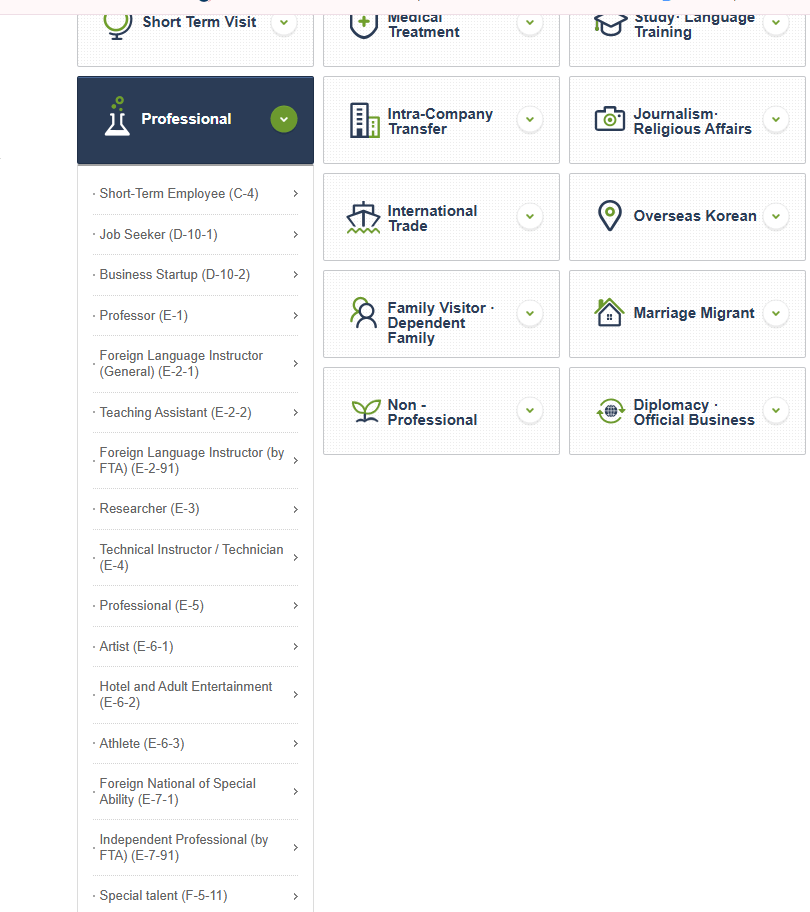
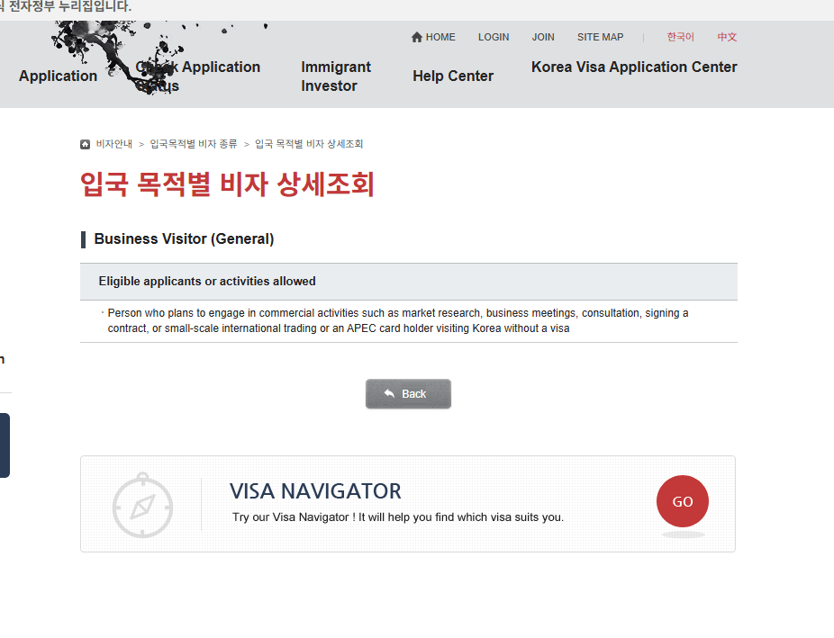
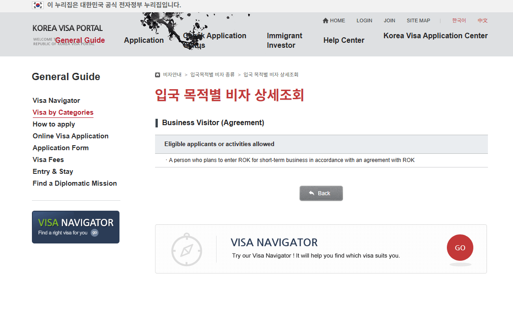
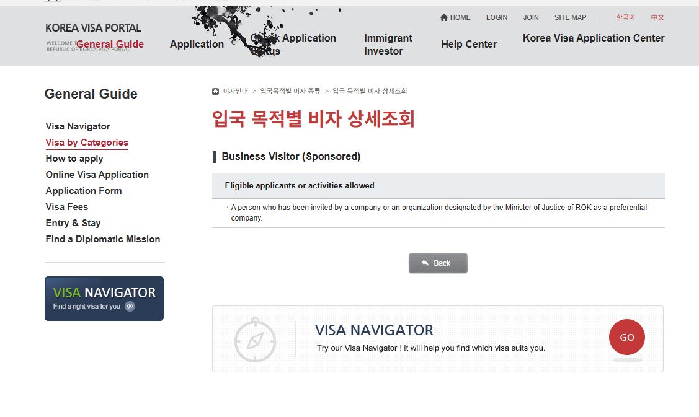
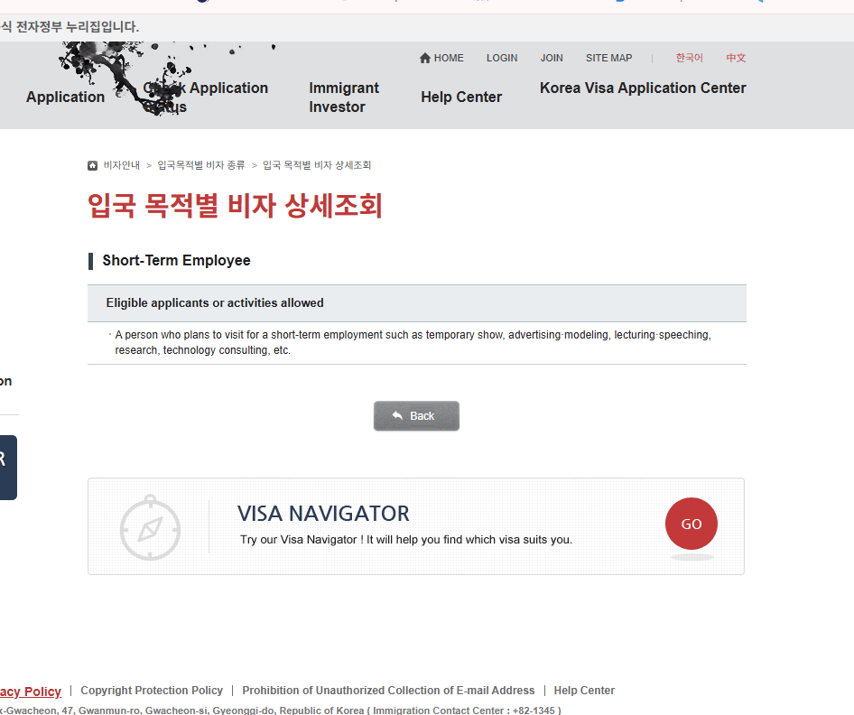
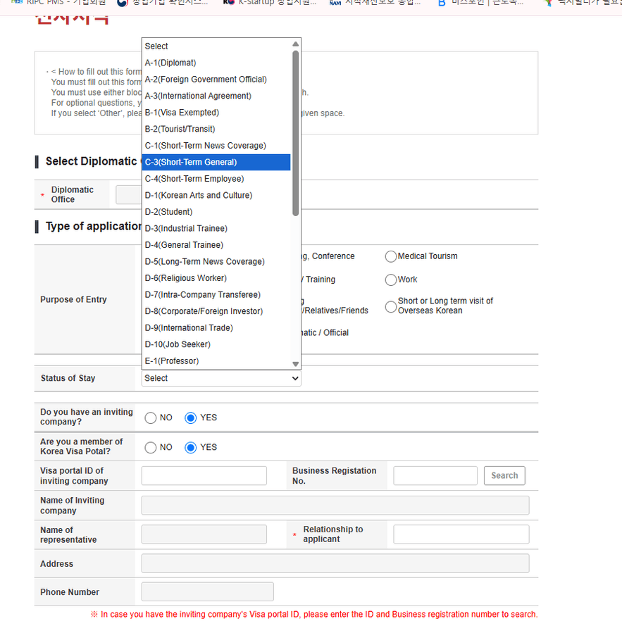
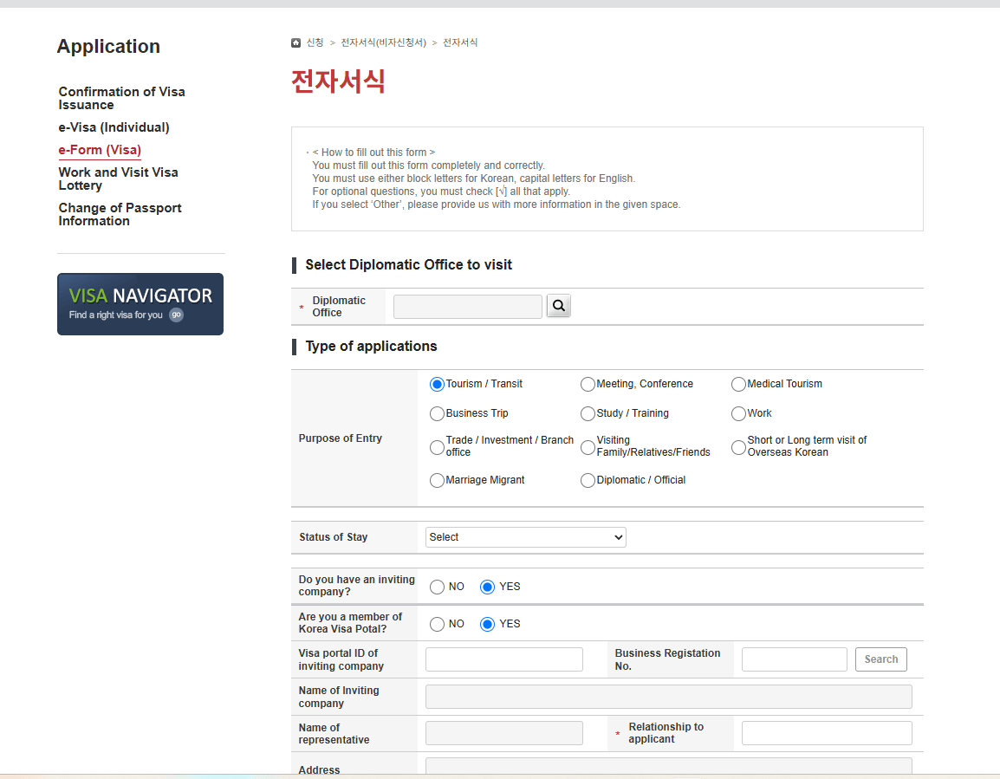
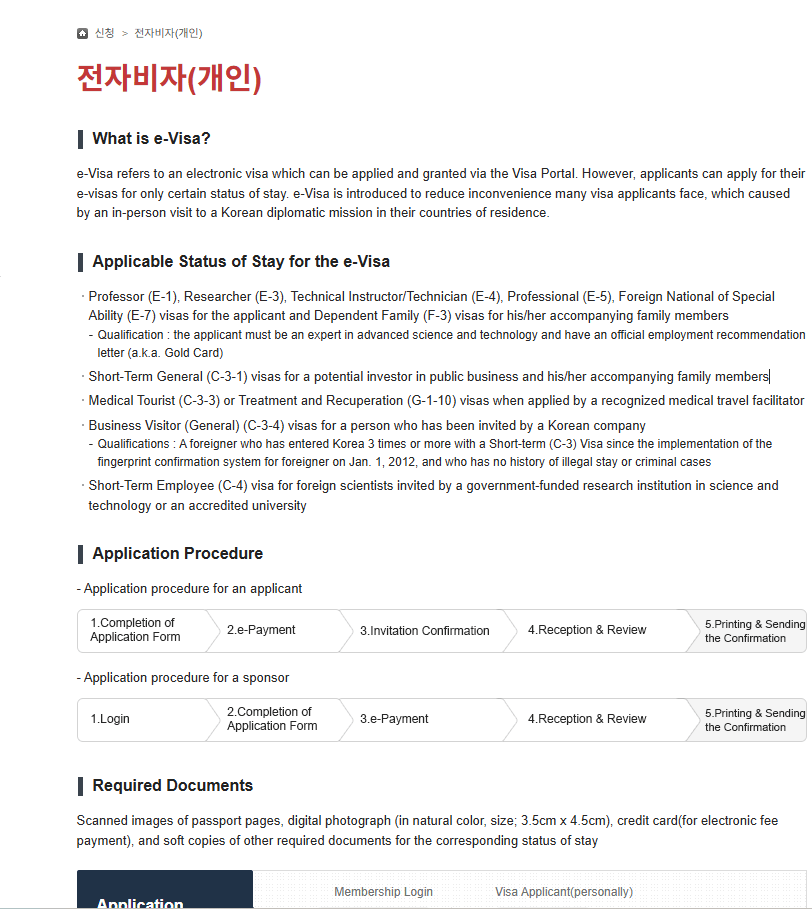
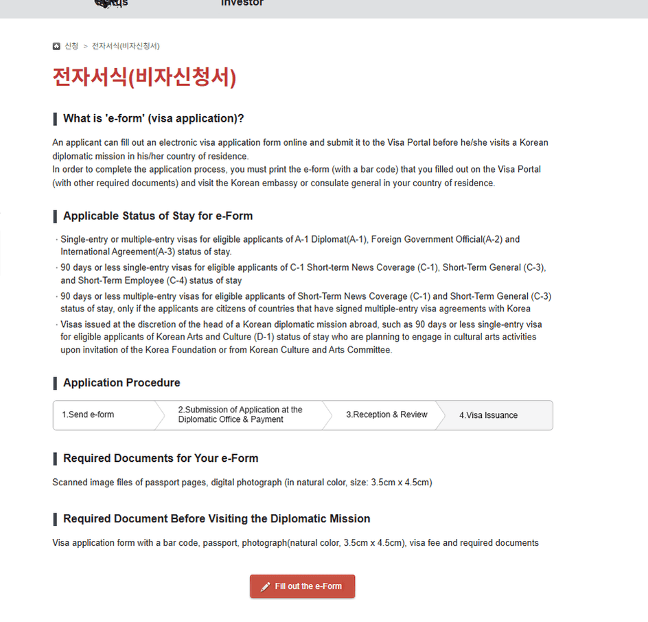

A trip your employer sends you on is not automatically a business visit under
Korea's immigration rules. The system splits somewhere else — not at who books
the flight, not at who pays you, and not at how long you stay.

<figure class="figure hero">
  <p class="figure-title">The line, in one sentence</p>
  <p class="figure-sub">From the Ministry of Justice visa manual, September 2026</p>
  <div class="check-card">
    <div class="check-row ok"><span class="mark"></span><span><strong>Talking about the installation</strong> — meeting the buyer, agreeing the spec, negotiating the contract — is a business visit.</span></div>
    <div class="check-row miss"><span class="mark"></span><span><strong>Doing the installation</strong> is work, and the manual says so by name.</span></div>
    <div class="check-row miss"><span class="mark"></span><span>And it stays work <strong>even if your salary is paid abroad</strong>. Where the money moves is not the test.</span></div>
  </div>
  <p class="figcap">Everything below is that distinction applied to the four routes people actually choose between.</p>
</figure>

Before any of it, check whether the trip needs a visa at all — for many
passports a short business visit is inside visa-free entry.

<div class="callout callout-note">
  <p class="callout-title">Start here</p>
  <p>The <a href="/tools/korea-entry-check/">Korea entry requirements check</a> answers visa-free scope, K-ETA and the arrival declaration separately.</p>
</div>

## The portal files them in two different places

Open **Short Term Visit** and the three business-visitor routes sit together:


<p class="figcap">Business Visitor (General) C-3-4, (Agreement) C-3-5 and (Sponsored) C-3-6.</p>

Open **Professional**, and C-4 is not with them:


<p class="figcap"><strong>Short-Term Employee (C-4)</strong> heads a list that runs on through Professor (E-1), Researcher (E-3) and Technical Instructor (E-4). That is the company it keeps.</p>

C-4 is filed with the work statuses. It is not a harder business visa; it is a
short employment visa that happens to be brief.

## C-3-4 — Business Visitor (General)


<p class="figcap">The portal's public wording. The manual behind it is more specific.</p>

The portal lists market research, business meetings, consultation, signing a
contract, small-scale international trading — and an APEC card holder entering
without a visa. The Ministry's manual uses the same list and then adds the part
that decides hard cases:

> Remuneration that does not exceed the cost of staying is included; **a person
> whose purpose is profit-making is excluded.**

So a stipend covering your hotel does not push you across the line. Coming to
earn does.

**Issued for 90 days, with three months of visa validity.** The documents are
the application, passport, photograph and fee, plus an invitation and evidence
of the commercial purpose — typically the inviting company's business
registration certificate or corporate registry extract. Missions set their own
list to suit local conditions.

<div class="callout callout-note">
  <p class="callout-title">The APEC card, spelled out</p>
  <p>The manual gives the ABTC its own box: the scheme covers Korea, Japan, Australia, New Zealand, Hong Kong, the Philippines, Taiwan, Thailand, Malaysia, Brunei, Peru, Chile, China, Indonesia, Papua New Guinea, Singapore, Vietnam, Mexico and Russia. Korea treats a holder as <strong>C-3, 90 days, with the same effect as a multiple-entry visa</strong>.</p>
  <p>It does not, however, excuse the arrival declaration — ABTC holders are named on the e-Arrival Card's must-file list.</p>
</div>

## The rule that decides most real cases

This is the paragraph worth sending to whoever books the flights.

<div class="callout callout-warn">
  <p class="callout-title">⚠️ Installation, maintenance, fabrication, supervision</p>
  <p>The manual states that where a foreign national is dispatched to a Korean public or private organisation for the <strong>installation or maintenance of imported machinery, shipbuilding, or the fabrication or supervision of industrial equipment</strong>, the activity is profit-making and <strong>falls outside the scope of the short-stay statuses B-1, B-2 and C-3</strong>. Such cases are to be issued <strong>C-4 short-term employment</strong> or <strong>D-9 trade management</strong> instead.</p>
</div>

Read that against C-3-4's own list and the boundary becomes usable rather than
philosophical:

```
BUSINESS VISIT                      SHORT-TERM WORK
market research                     installing imported machinery
business contact                    maintaining or repairing it
consultation                        shipbuilding work
contract negotiation and signing    fabricating or supervising equipment
small-scale trading                 substantive services under a contract
```

Discussing the installation is on the left. Performing it is on the right. The
same engineer can make both trips in the same year and need different routes
for them.

## And being paid abroad does not move you back

The manual anticipates the obvious workaround and closes it in a footnote to
the C-4 activity list:

> A person dispatched under a service contract, purchase contract, project
> contract or similar arrangement, to be paid remuneration-type expenses by a
> Korean public or private organisation — **including a person who receives
> those expenses outside Korea rather than in it, where they provide
> substantive services or perform substantive work.**

So "my Korean customer isn't paying me, my employer in Stuttgart is" answers a
question nobody asked. The test is what you do here, not where the money
lands.

## C-3-5 — Business Visitor (Agreement)


<p class="figcap">Not a longer C-3-4. A different basis, and the manual names which agreements.</p>

Two agreements are named in the manual, and they are not interchangeable.

Under the **Korea–India CEPA**, the person covered is an employee of an Indian
corporation visiting to negotiate the sale of goods or services, or to prepare
the establishment of an investment company.

Under the **Korea–Chile FTA**, the activities named are research and design,
manufacturing and production, marketing, sales, distribution, after-sales
service and general services.

| Agreement | Stay | Visa validity |
| --- | --- | --- |
| Korea–India CEPA | 90 days | 3 months |
| Korea–Chile FTA | **6 months** | 3 months |

Note the Chile row: six months of stay, not 90 days, which is the sort of thing
worth knowing before assuming every C-3 is a quarter.

You do not choose C-3-5 because the trip is short and business-related. Either
an agreement covers you or it does not.

## C-3-6 — Business Visitor (Sponsored)


<p class="figcap">A structure, not a duration — and a closed one.</p>

C-3-6 runs on an invitation, through the Visa Portal, from a company or
organisation selected as a **preferential company** — selection requiring a
recommendation from the Minister of SMEs and Startups, the chairman of the
Korea Federation of SMEs, or the chairman of the Korea International Trade
Association.

<div class="callout callout-warn">
  <p class="callout-title">⚠️ Selection of new preferential companies has ended</p>
  <p>The manual states it plainly: the route applies to firms <strong>already selected</strong>. A Korean company cannot decide today to become a C-3-6 sponsor, so if your host is not already on that list, this row is not yours.</p>
</div>

For those it does cover: **90 days of stay, one year of validity, multiple
entry**, applied for as a Confirmation of Visa Issuance on **Form No. 21**,
with the applicant's employment certificate and an invitation issued by the
preferential company. The sponsor files in Korea; the applicant then applies at
a mission with the confirmation.

## C-4 — Short-Term Employee


<p class="figcap">Defined as short-term activity <em>for profit</em> — which is the whole point.</p>

Outside the seasonal-work subtypes, **C-4-5** covers:

<div class="check-card">
  <div class="check-row miss"><span class="mark"></span><span><strong>Temporary performances</strong>, and <strong>advertising or fashion work</strong> — both cross-referenced to the E-6 entertainment status.</span></div>
  <div class="check-row miss"><span class="mark"></span><span><strong>Lecturing or speaking</strong> under a contract carrying income, on invitation from a Korean organisation. Where no income follows, the manual sends it back to C-3.</span></div>
  <div class="check-row miss"><span class="mark"></span><span><strong>Research and technical guidance</strong> — cross-referenced to E-3 and E-4.</span></div>
  <div class="check-row miss"><span class="mark"></span><span><strong>Work under a contract with a Korean organisation</strong> — cross-referenced to E-7.</span></div>
  <div class="check-row miss"><span class="mark"></span><span><strong>Installation and maintenance of imported machinery</strong>, shipbuilding, industrial equipment fabrication and supervision, under service, purchase or project contracts.</span></div>
  <div class="check-row miss"><span class="mark"></span><span><strong>Advanced technology fields</strong> — IT, e-business, biotechnology, nanotechnology, new materials, transport machinery, digital electronics, environment and energy, technology management.</span></div>
</div>

The cap on a single grant is **90 days**. And one exclusion worth stating
outright: **simple manual labour does not qualify for C-4-5.** C-4 is not a
general-purpose short-term work permit.

For the machinery case, the manual asks for the underlying **service, purchase
or project contract** and a **dispatch or business-trip order** on top of the
usual application, passport, photograph and fee — and requires that the
contract actually contain the installation obligation, and that the applicant
hold the skills it needs.

## The narrow exception for a public-interest talk

Not every paid-sounding lecture is C-4, but the exemption is tight and **every
condition has to hold at once**:

<div class="check-card">
  <div class="check-row ok"><span class="mark"></span><span>The inviter is a <strong>government body, local authority, university, government-funded institute or other non-profit</strong>, inviting for academic or public-interest purposes.</span></div>
  <div class="check-row ok"><span class="mark"></span><span>It is a <strong>one-off</strong> lecture, talk or advisory activity, not employment under an employment contract.</span></div>
  <div class="check-row ok"><span class="mark"></span><span>No more than <strong>five Korean institutions</strong> during the stay.</span></div>
  <div class="check-row ok"><span class="mark"></span><span>The activity totals no more than <strong>seven days</strong> during the stay.</span></div>
</div>

Meet all four and a C-3, B-1 or B-2 holder can do it. A private company
inviting you for a commercial purpose is C-4-5 regardless — the manual says so
in the same breath.

Which is why "am I being paid?" is the wrong first question. Who invited you,
why, under what arrangement, and for how much of your stay all sit above it.

## Status and channel are two different questions


<p class="figcap">Separate radio buttons for <strong>Meeting, Conference</strong>, <strong>Business Trip</strong> and <strong>Work</strong> — then a separate Status of Stay list where C-3 and C-4 are different rows.</p>

Note that the dropdown offers **C-3 (Short-Term General)**, not C-3-4, C-3-5
and C-3-6 as separate items. Picking C-3 there does not settle which
sub-category you end up in.

The same screen asks whether a Korean company is inviting you, and wants its
Visa Portal ID, business registration number, name, representative and
relationship to you:


<p class="figcap">The Korean host is part of the application, not background to it.</p>

### e-Visa and e-Form are not the same thing


<p class="figcap">e-Visa exists to remove the in-person visit — for the statuses it covers.</p>


<p class="figcap">An e-Form is an online <em>form</em>. You print it with its barcode and take it to the consulate.</p>

<div class="callout callout-warn">
  <p class="callout-title">⚠️ The C-3-4 e-Visa condition belongs to the channel, not the visa</p>
  <p>The frequent-business-traveller e-Visa route needs an invitation from a Korean company, <strong>three or more prior entries on C-3 status since 1 January 2012</strong>, and no record of illegal stay or other violations during them. It grants 90 days on a three-month single-entry visa.</p>
  <p>That is not “you need three previous trips to get a C-3-4”. It is what one online channel requires. Which status fits your activity and which channel you may use are separate questions.</p>
</div>

## Which side is your trip on?

| What you will actually do in Korea | Look at |
| --- | --- |
| Business meeting, market research, consultation | Visa-free if eligible, otherwise C-3-4 |
| Negotiating or signing a contract | Visa-free if eligible, otherwise C-3-4 |
| Small-scale international trading | C-3-4 |
| Indian corporation, sales negotiation or investment set-up | C-3-5 (CEPA) |
| Research, design, production, marketing, distribution, after-sales | C-3-5 (Chile FTA) |
| Invited by an already-designated preferential company | C-3-6 |
| Installing imported machinery | C-4, or D-9 depending on the arrangement |
| Maintaining or repairing it | C-4 or D-9 |
| Shipbuilding, equipment fabrication or supervision | C-4 or D-9 |
| Substantive services under a contract | C-4 |
| Paid lecture or talk | C-4-5 |
| One-off talk for a non-profit, ≤5 institutions, ≤7 days | C-3 / B-1 / B-2 may work |
| Temporary performance, advertising or modelling | C-4-5 |
| Research or technical guidance for income | C-4-5 |
| Simple manual labour | Not C-4-5 — a different work status |

A routing aid, not a determination. The mission reviews the case, and the
manual itself is explicit that offices may add to or subtract from its document
lists.

## Two things that do not work

<div class="callout callout-warn">
  <p class="callout-title">⚠️ Entering on the easiest C and fixing it later</p>
  <p>The application form states that category C visa holders cannot change their status of stay after entering Korea, under Article 9(1) of the Enforcement Regulations of the Immigration Act. C-3-4, C-3-5, C-3-6 and C-4 are all category C.</p>
</div>

<div class="callout callout-warn">
  <p class="callout-title">⚠️ Describing work as tourism</p>
  <p>C-3-9 is the <a href="/visas/korea-c-3-9-tourist-visa/">ordinary tourist route</a>, not a fallback. The form warns that false information or documents lead to revocation of the visa and of permission to stay, and may bring criminal punishment and an entry ban.</p>
</div>

## The order to answer in

<div class="steps">
  <div class="step"><div class="step-num">1</div><div class="step-body"><strong>Whose passport, and can it use visa-free entry?</strong></div></div>
  <div class="step"><div class="step-num">2</div><div class="step-body"><strong>What will the traveller physically do in Korea?</strong> Described as an activity, not a job title.</div></div>
  <div class="step"><div class="step-num">3</div><div class="step-body"><strong>Is a substantive service being provided to a Korean organisation?</strong> If yes, the business-visitor side is probably not available — regardless of where the salary is paid.</div></div>
  <div class="step"><div class="step-num">4</div><div class="step-body"><strong>Is there a service, purchase or project contract?</strong> That document is both the trigger and the evidence.</div></div>
  <div class="step"><div class="step-num">5</div><div class="step-body"><strong>Does an agreement or an already-designated sponsor apply?</strong> C-3-5 or C-3-6 rather than C-3-4.</div></div>
  <div class="step"><div class="step-num">6</div><div class="step-body"><strong>Which channel am I eligible for?</strong> e-Visa, e-Form, Confirmation of Visa Issuance, or the mission counter.</div></div>
  <div class="step"><div class="step-num">7</div><div class="step-body"><strong>What does that mission currently require?</strong> Its list governs.</div></div>
</div>

Do not run it backwards by choosing a convenient visa and describing the trip
to fit.

## Make the documents tell one story

Invitation, contract, dispatch order, application and the purpose ticked on the
form should all describe the same trip: who invited the traveller, why, what
will be performed, which contract requires it, how long it takes, and who is
paying. Inconsistency between those is a problem you create for yourself.

<div class="callout callout-note">
  <p class="callout-title">Next</p>
  <p>Entering on a visa puts you on the list of people who file the <a href="/visas/how-to-fill-out-korea-e-arrival-card/">e-Arrival Card</a>. If the entry check said visa-free instead, <a href="/visas/how-to-apply-for-k-eta-step-by-step/">K-ETA</a> is the thing to sort out.</p>
</div>

## The short version

Korea does not ask whether you are travelling for business. It asks whether you
are coming **to conduct business** or **to perform work**, and it files those
two answers in different parts of the system.

C-3-4 for market research, business contact, consultation, contracts and
small-scale trading — with pay that does not exceed your costs, and not for
profit. C-3-5 under the India CEPA or the Chile FTA. C-3-6 where an
already-designated preferential company invites you. C-4 for profit-making
short-term activity: performances, advertising, paid talks, research, technical
guidance, and the installation and maintenance work that the manual names by
hand.

And the sentence to take away, because it is the one most trips get wrong:
**work performed in Korea stays work even when you are paid abroad.**
