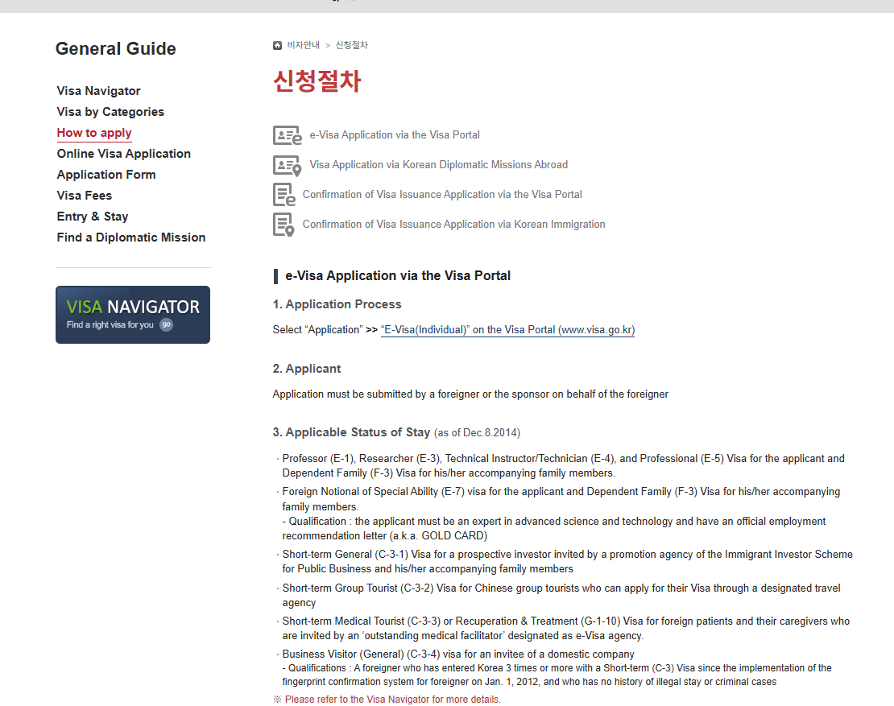
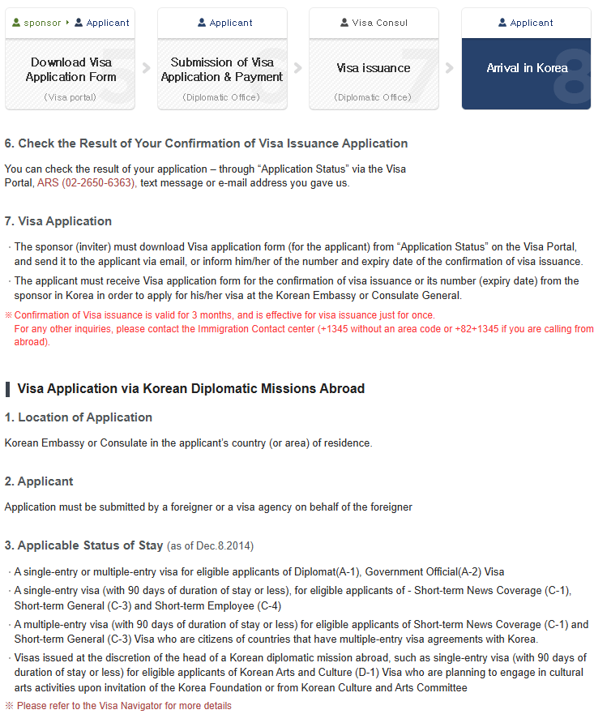
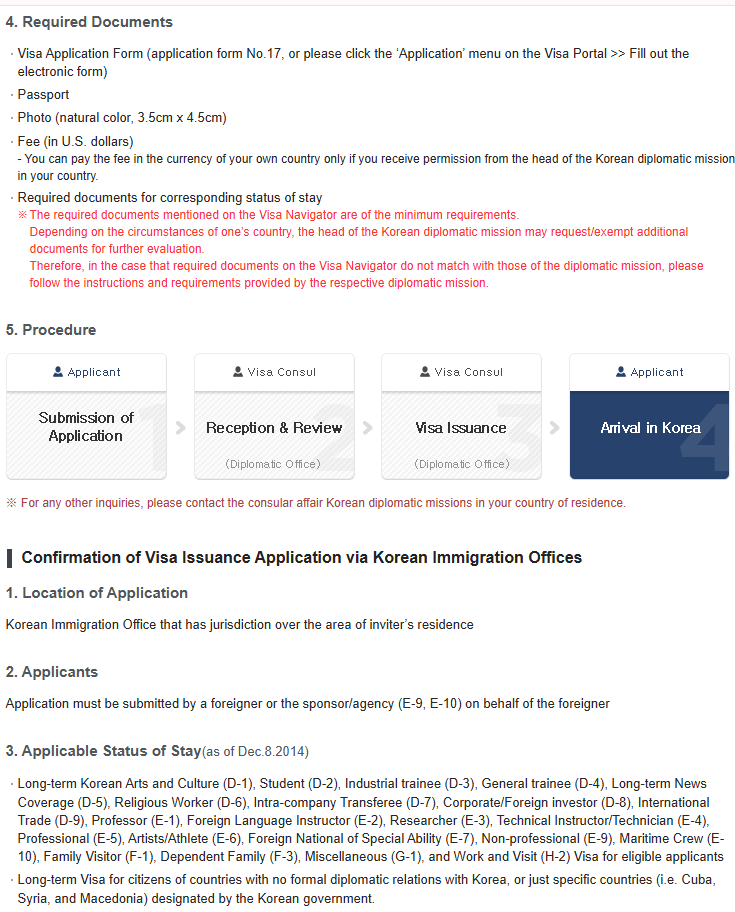

If you are coming to Korea for a holiday and visa-free entry is not open to
you, **Ordinary Tourist (C-3-9)** is the route to look at. That is the portal's
own English name for it — worth knowing, because "general tourist visa" is what
most guides call it and it is not what the official list says.

But do not start by downloading the form. Start one question earlier: do you
need a visa at all? For a great many passports the answer is no, and the whole
exercise is unnecessary.

<div class="callout callout-note">
  <p class="callout-title">Before anything else</p>
  <p>The <a href="/tools/korea-entry-check/">Korea entry requirements check</a> answers whether your passport is in scope for visa-free entry and for how long. If it is, your route is visa-free entry plus K-ETA where it applies — not this.</p>
</div>

## Korea sorts visas by purpose, not by length

The Visa Portal's *Visa by Categories* screen is a grid of fifteen purposes:
Short Term Visit, Medical Treatment, Study·Language Training, Professional,
Intra-Company Transfer, Journalism·Religious Affairs, Investment, International
Trade, Overseas Korean, Work and Visit, Family Visitor·Dependent Family,
Marriage Migrant, Trainee, Non-Professional, and Diplomacy·Official Business.


<p class="figcap">Fifteen purposes. A holiday is inside the first card, <strong>Short Term Visit</strong> — along with eleven other things.</p>

Open that first card and it expands into a list that makes the point better
than any explanation:


<p class="figcap">Twelve routes under one heading. <strong>Ordinary Tourist (C-3-9)</strong> is the tenth of them, not the default.</p>

```
Visa Exempted                 B-1        Business Visitor (Agreement)   C-3-5
Tourist / Transit (General)   B-2-1      Business Visitor (Sponsored)   C-3-6
Tourist / Transit (Jeju)      B-2-2      Short term Visitor
Short-Term General            C-3-1        (Overseas Korean)            C-3-8
Group Tourist                 C-3-2      Ordinary Tourist               C-3-9
Business Visitor (General)    C-3-4      Working Holiday                H-1
                                         Direct Transit (Air-side)      C-3-10
```

Note what the three business rows are called: **General**, **Agreement** and
**Sponsored**. Even inside business travel the portal splits by how the trip is
arranged, not by how long it runs.

<div class="callout callout-warn">
  <p class="callout-title">⚠️ “Under 90 days” is not a visa category</p>
  <p>Six of those twelve are short stays. What separates them is <strong>what you will do</strong> — sightseeing, a business meeting, a commercial visit, transit, a working holiday. Picking C-3-9 because the trip is short is choosing the wrong one about half the time.</p>
</div>

## What C-3-9 actually covers

The portal's entire published scope for Ordinary Tourist is one sentence:


<p class="figcap">Under <em>Eligible applicants or activities allowed</em>, one line. That is the whole published scope.</p>

> A person who plans to visit Korea on the purpose of travel for holidays or leisure.

A holiday. Sightseeing. Leisure. If your reason for coming is a meeting, paid
work, a trade visit or a course, a different row in that list is yours — and
picking tourism because it looks like less paperwork is the mistake this whole
page exists to prevent.

## Four ways to apply, and a tourist can use one of them

The portal's *How to apply* page lists four routes:


<p class="figcap">e-Visa, a diplomatic mission, and two Confirmation of Visa Issuance routes filed by a sponsor in Korea.</p>

The e-Visa route is the one people hope for, and it is worth checking against
its own list before you plan around it. The statuses it covers are E-1, E-3,
E-4, E-5 and E-7 with dependants, plus **C-3-1** for an invited prospective
investor, **C-3-2** for Chinese group tourists through a designated agency,
**C-3-3** for medical tourists with an approved facilitator, and **C-3-4** for
a business visitor invited by a domestic company.

<div class="callout callout-warn">
  <p class="callout-title">⚠️ C-3-9 is not on the e-Visa list</p>
  <p>General tourism is not one of the statuses that route covers. An ordinary holiday applicant applies <strong>through a Korean embassy or consulate</strong> — and the two Confirmation of Visa Issuance routes are filed by a sponsor in Korea, which a self-funded tourist does not have.</p>
</div>

## Applying through a mission

The place of application is the **Korean embassy or consulate in your country
or area of residence**. Not the nearest, not the quickest — the one responsible
for where you live.


<p class="figcap">A <strong>single-entry</strong> visa of 90 days or less for C-1, C-3 and C-4. Multiple entry only for nationals of countries that have a multiple-entry agreement with Korea.</p>

What that route wants is short: the visa application form (**form No. 17**, or
the electronic form on the portal), your passport, a natural-colour photograph
at 3.5 × 4.5 cm, the fee **in US dollars**, and the documents the status itself
requires.


<p class="figcap">Note the process row at the foot: <strong>Submission → Reception &amp; Review → Visa Issuance → Arrival</strong>. Submitting is not being issued.</p>

Two details in there catch people. The fee is denominated in US dollars, and
paying in your own currency needs the permission of the head of the mission.
And the document list is a floor, not a ceiling — in the portal's own words:

<div class="callout callout-warn">
  <p class="callout-title">⚠️ The mission's list wins</p>
  <p>“The required documents mentioned on the Visa Navigator are of the minimum requirements. Depending on the circumstances of one's country, the head of the Korean diplomatic mission may request/exempt additional documents for further evaluation. Therefore, in the case that required documents on the Visa Navigator do not match with those of the diplomatic mission, please follow the instructions and requirements provided by the respective diplomatic mission.”</p>
  <p>Which is why a checklist copied from a different country's Korean consulate is not your checklist. It looks authoritative and it is wrong for you.</p>
</div>

That is also why there is no fee figure and no processing time in this guide.
Both are set by the mission handling your application, and a number lifted from
somewhere else is worse than no number.

<div class="callout callout-note">
  <p class="callout-title">One thing to check for yourself</p>
  <p>The portal dates its eligible-status lists “as of Dec. 8. 2014”. They are the current published lists, but they carry that date — so confirm anything decision-critical with your own mission rather than with the date stamp.</p>
</div>

## The form is five pages

The current form is the **VISA APPLICATION FORM** prescribed under the
Enforcement Regulations of the Immigration Act. It is bilingual, Korean above
English, and it opens with its own instructions: complete every item, write in
Korean or English, tick every box that applies, and explain anything answered
“Other”.


<p class="figcap">Page 1. The photo is <strong>35 × 45 mm</strong> — the portal writes the same size as 3.5 × 4.5 cm — taken within the last six months, full face, no hat, white or off-white background.</p>

Page 1 also splits the application at the top: **long-term stay over 90 days**
or **short-term stay less than 90 days**, then the status of stay you are
applying for. Page 2 takes passport details, contact details, an emergency
contact, marital status and education.

Page 3 opens with employment — Entrepreneur, Self-Employed, Employed, Civil
Servant, Student, Retired, Unemployed, Other — and then reaches the section
that matters most for a tourist.

## Section 8: Details of Visit


<p class="figcap">One page carries the purpose, the dates, the Korean address and five years of travel history.</p>

**8.1 Purpose of Visit to Korea** offers eleven boxes:

```
Tourism/Transit                              Work
Meeting, Conference                          Trade/Investment/Intra-Corporate Transferee
Medical Tourism                              Visiting Family/Relatives/Friends
Business Trip                                Marriage Migrant
Study/Training                               Diplomatic/Official
                                             Other
```

For a C-3-9 application, **Tourism/Transit** is the box. But tick the one that
is true: *Business Trip* and *Meeting, Conference* are separate boxes for a
reason, and so is *Work*.

The rest of the section is short and literal:

<div class="check-card">
  <div class="check-row ok"><span class="mark"></span><span><strong>8.2 Intended Period of Stay</strong> and <strong>8.3 Intended Date of Entry</strong> — the trip you are actually taking.</span></div>
  <div class="check-row ok"><span class="mark"></span><span><strong>8.4 Address in Korea (including hotels)</strong> — the accommodation's real address, not just the city.</span></div>
  <div class="check-row ok"><span class="mark"></span><span><strong>8.5 Contact No. in Korea</strong>.</span></div>
  <div class="check-row ok"><span class="mark"></span><span><strong>8.6</strong> Have you travelled to Korea in the last five years? If yes: how many times, purpose, and the period of each.</span></div>
  <div class="check-row ok"><span class="mark"></span><span><strong>8.7</strong> Have you travelled outside your country of residence, excluding Korea, in the last five years? If yes: country, purpose, period.</span></div>
</div>

Answer 8.6 and 8.7 fully. They ask about travel, not about relevance — leaving
out a trip because it had nothing to do with this one is not what the question
says.

Page 4 carries family in Korea, family travelling with you, and whether anyone
is inviting you, then **funding**: estimated costs in US dollars, who is
paying, their relationship to you, and how. Keep that consistent with whatever
financial evidence your mission asks for. The form then asks whether anyone
helped you complete it, and for their details if so.

## Page 5 is the page to read twice


<p class="figcap">Seven numbered notices, then the declaration and signature.</p>

Three of the seven decide things.

<div class="callout callout-warn">
  <p class="callout-title">⚠️ A visa is not admission</p>
  <p>“Possession of a visa does not entitle the bearer to enter the Republic of Korea upon arrival at the port of entry if he/she is found inadmissible.” Two decisions, two offices. The consulate issues; the officer at the border admits.</p>
</div>

<div class="callout callout-warn">
  <p class="callout-title">⚠️ C means no change of status afterwards</p>
  <p>“Please note that category C visa holders are not able to change their status of stay after their entry into the Republic of Korea in accordance with Article 9(1) of the Enforcement Regulations of the Immigration Act.”</p>
  <p>This is the line that costs people the most. Arriving on a tourist route intending to convert to work or study once you are here does not work — the conversion is not available to category C. Choose the route before you fly.</p>
</div>

The third: false information or documents leads to revocation of the visa and
of permission to stay, and may result in criminal punishment and an entry ban.
Failing to submit requested documents can delay the review or end it in a
refusal.

Results are checked on the Visa Portal — Check Application Status, then Check
Application Status & Print, then Diplomatic Office, then your passport and
personal details. A written disapproval notice has to be collected from the
mission in person.

Then sign and date it. A person under 17 needs a parent's or legal guardian's
signature, and the form warns that a missing name or signature can be enough on
its own for the application to be denied.

## Before you submit

<div class="check-card">
  <div class="check-row ok"><span class="mark"></span><span>I checked whether I need a visa at all, rather than visa-free entry.</span></div>
  <div class="check-row ok"><span class="mark"></span><span>Tourism is my actual purpose — not business, work or study.</span></div>
  <div class="check-row ok"><span class="mark"></span><span>I am applying through a mission, not the e-Visa route — C-3-9 is not on its list.</span></div>
  <div class="check-row ok"><span class="mark"></span><span>I am applying to the mission with jurisdiction over where I live, using <em>its</em> current document list.</span></div>
  <div class="check-row ok"><span class="mark"></span><span>My name on the form matches my passport exactly.</span></div>
  <div class="check-row ok"><span class="mark"></span><span>The Korean address is the accommodation's real address.</span></div>
  <div class="check-row ok"><span class="mark"></span><span>Five years of travel history is complete, including trips that seem unrelated.</span></div>
  <div class="check-row ok"><span class="mark"></span><span>Funding details match the financial evidence I am submitting.</span></div>
  <div class="check-row ok"><span class="mark"></span><span>I understand I cannot change status after entering on a category C visa.</span></div>
  <div class="check-row ok"><span class="mark"></span><span>Signed and dated.</span></div>
</div>

## After the visa, one more filing

A Korean visa and the e-Arrival Card are different things, and holding the
first does not settle the second. Entering on a visa puts you on the list of
people who file the arrival declaration — visa holders are its first entry.

<div class="callout callout-note">
  <p class="callout-title">Next</p>
  <p><a href="/cost-of-living/how-to-fill-out-korea-e-arrival-card/">How to fill out the e-Arrival Card</a>, field by field. And if the entry check said visa-free after all, <a href="/cost-of-living/how-to-apply-for-k-eta-step-by-step/">how to apply for K-ETA</a> instead.</p>
</div>

## The short version

C-3-9 — Ordinary Tourist — is the route for people a visa-free scheme does not cover. The
form is five pages and the two lines that matter are both on the last one: a
visa is not admission, and category C cannot change status afterwards.

Everything else follows from one question, and it is not "which visa is
easiest" — it is what you are actually going to do in Korea.
