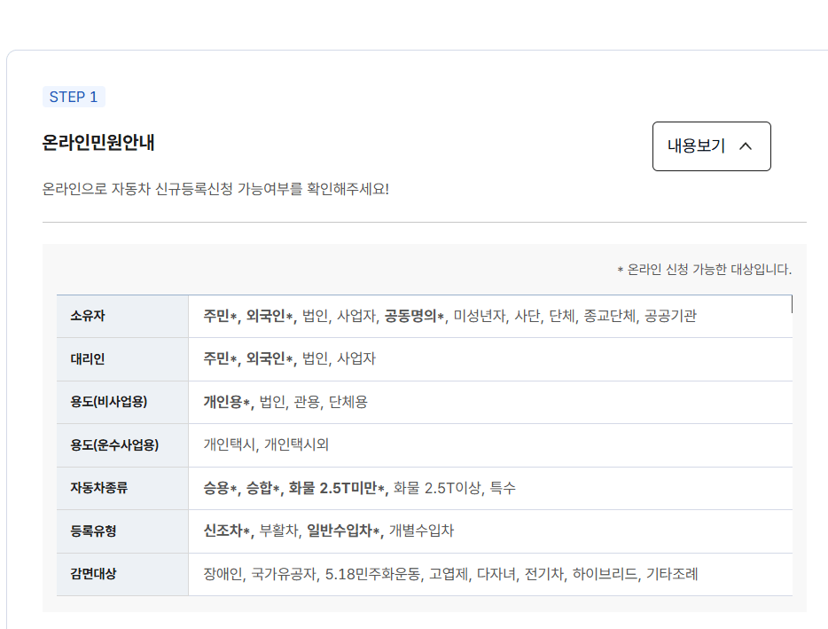
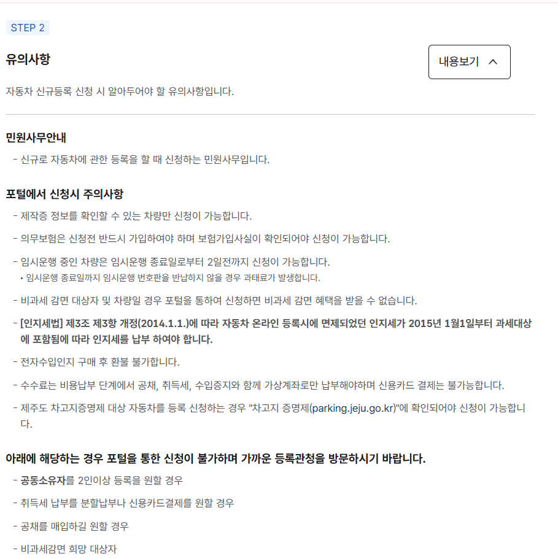
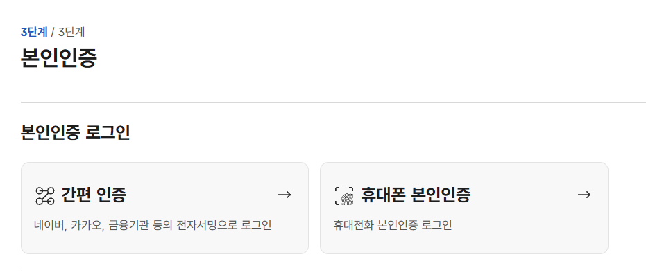
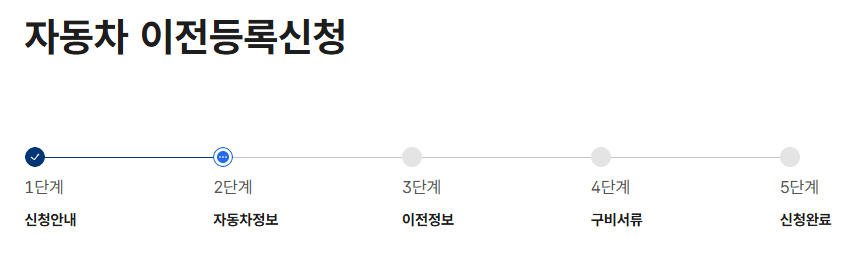
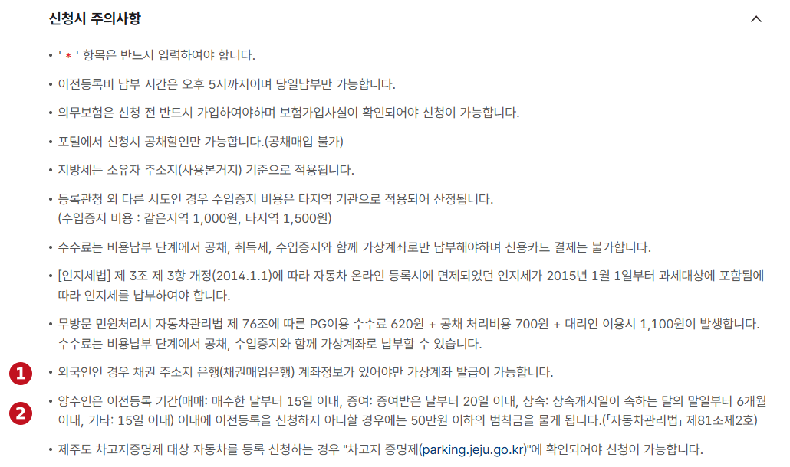
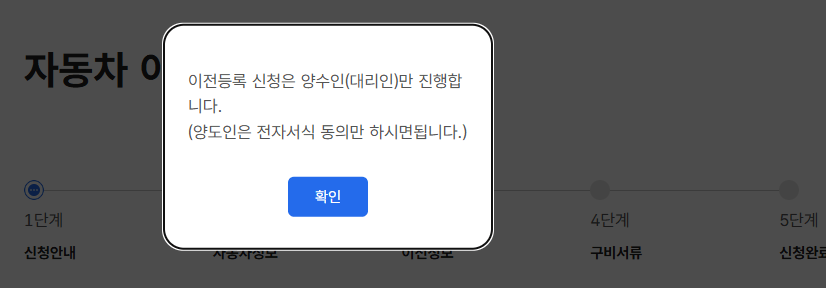
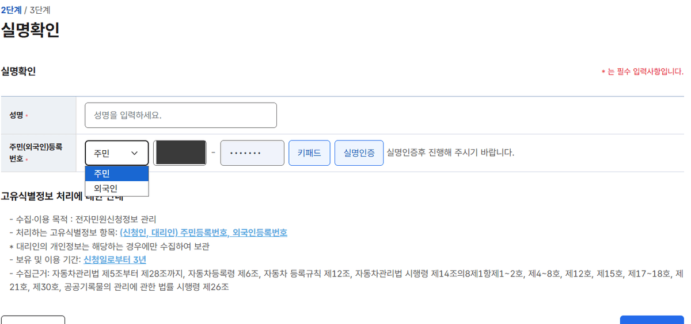
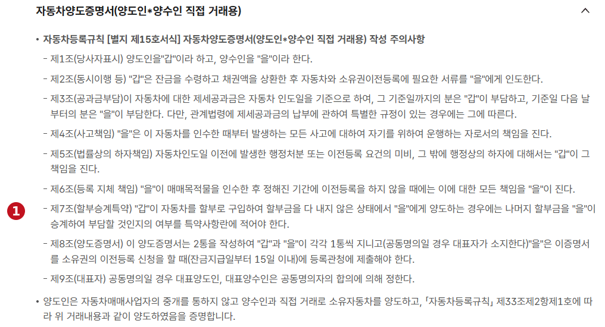

Buying a car and putting it in your name are two different steps, and for a
foreign resident the second one has a reputation it does not deserve. The
systems do overlap — your Residence Card, mandatory insurance, acquisition
tax, local bonds, the registration authority and the Car365 portal — but the
first question has a clean answer.

<figure class="figure hero">
  <p class="figure-title">Three things Car365 states outright</p>
  <p class="figure-sub">From the new-registration guidance, read 30 September 2026</p>
  <div class="check-card">
    <div class="check-row ok"><span class="mark"></span><span><strong>Foreigners are eligible owners.</strong> 외국인 is in the owner list, marked as accepted by the online service — and in the representative list too.</span></div>
    <div class="check-row miss"><span class="mark"></span><span><strong>Insurance comes before the application</strong>, not after registration. The enrolment has to be confirmed before you can apply at all.</span></div>
    <div class="check-row miss"><span class="mark"></span><span><strong>Filing online forfeits a tax exemption.</strong> Not "go to the office instead" — apply through the portal and the reduction is gone.</span></div>
  </div>
  <p class="figcap">The rest of this guide is those three plus the table that says which cases the portal will take.</p>
</figure>

## Yes, and the page says so in a table

Car365's new-registration flow opens with an eligibility table, and the
asterisk is the whole document: it marks the types the online service
accepts.


<p class="figcap">STEP 1, 온라인민원안내. 소유자 (owner) and 대리인 (representative) both carry 외국인 with an asterisk. Grey entries without one are the office's business, not the portal's.</p>

Read down the rows and the picture is more specific than "foreigners can
register a car":

| Row | Accepted online | Not online |
| --- | --- | --- |
| Owner | Resident, **foreigner**, corporation, sole trader, joint ownership | Minor, association, organisation, religious body, public institution |
| Representative | Resident, **foreigner**, corporation, sole trader | — |
| Use (non-commercial) | Private | Corporate, official, organisational |
| Use (transport business) | — | Private taxi, and everything else |
| Vehicle type | Passenger, van, goods under 2.5t | Goods 2.5t and over, special |
| Registration type | Newly built, ordinary import | Restored, individual import |
| Reduction category | — | Disability, national merit, 5·18, defoliant, multi-child, EV, hybrid, other by ordinance |

Two rows are worth pausing on. **Joint ownership carries the asterisk** — the
portal does take it, so the common claim that two names always means an
office visit is wrong for new registration. And the **entire reduction row is
grey**, which is the sharpest line on the page: if you qualify for a
reduction, the portal is not a slower route to it. It is the wrong route.

## Insurance before the application, not after registration

The order most first-time buyers expect is buy, register, insure. Car365
puts insurance first, and makes it a gate:

> 의무보험은 신청전 반드시 가입하여야 하며 보험가입사실이 확인되어야 신청이
> 가능합니다.
>
> Mandatory insurance must be taken out before the application, and the
> enrolment must be confirmed before the application is possible.


<p class="figcap">STEP 2, 유의사항. The insurance line is the second bullet. The virtual-account rule is near the bottom, and the four cases that send you to an office are the list below the bold line.</p>

So the real sequence is:

```
confirm the purchase  →  take out mandatory insurance
                      →  registration application
                      →  bond, acquisition tax, fees
                      →  plates
```

For what the insurance itself costs and how driver limits work, that is a
different guide: [Korean car insurance for
expats](/insurance/korean-car-insurance-for-expats-explained/).

## The conditions that catch people

The same STEP 2 panel carries five conditions that are easy to read past.

**Only vehicles whose manufacturer certificate can be verified.** The portal
checks the 제작증 before it will take the application at all.

**Temporary-operation plates have a deadline of their own.** A vehicle on
temporary operation can be applied for up to two days before the temporary
period ends, and failing to return the temporary plates by that date brings a
penalty.

**A reduction claimed online is a reduction lost.** The page does not say the
benefit is delayed or has to be claimed separately — it says an eligible
applicant or vehicle applying through the portal cannot receive it.

**The stamp tax is not a portal fee.** Online vehicle registration used to be
exempt; an amendment to the Stamp Tax Act effective 1 January 2015 brought it
into scope, which is why a stamp charge appears on an electronic filing at
all. Electronic revenue stamps are not refundable once bought.

**Payment is virtual-account only.** Fees are paid at the cost-payment stage
together with the bond, acquisition tax and revenue stamp, through a virtual
account. Card payment is not available in this route.

<div class="callout callout-warn">
  <p class="callout-title">Jeju has an extra gate</p>
  <p>A vehicle subject to Jeju's parking-space certification cannot be applied for until that certification is confirmed at <strong>parking.jeju.go.kr</strong>. It is the one region-specific condition on the page.</p>
</div>

## Getting in: an account is not the only route

The portal has a non-member route, and it ends at an identity step with two
methods.


<p class="figcap">3단계 본인인증, the last of three. 간편 인증 signs in with an electronic signature from Naver, Kakao or a financial institution; 휴대폰 본인인증 uses mobile-phone verification.</p>

Worth knowing before you plan an afternoon around it: what the screen does
not say is whether either method will accept a given foreign registration
number or a phone contract in your name. Those are properties of Korea's
identity infrastructure rather than of the vehicle portal, and this page does
not speak for them.

That is the practical difference between the two facts this guide keeps
separate. The right to register a car in your own name is settled, and the
table above settles it. Whether every online step will go through on the
first attempt is a different question, and the registration authority is one
of the normal filing routes rather than a fallback for when it does not.

## Four cases the portal will not take

Below the conditions, Car365 lists the situations that send you to a
registration authority. The capture shows four:

- Registering **three or more joint owners** — two the portal takes, more it does not.
- Wanting to pay **acquisition tax in instalments or by card**.
- Wanting to **buy the bond** rather than take the discount route.
- Being an applicant who **wants a non-taxable reduction**.

Three of those four are choices rather than circumstances. You are not being
excluded — you are asking for something the online route does not do, and the
counter does.

## Which registration is yours

Everything above is 신규등록, new registration, for a vehicle entering Korea's
register for the first time. A car that is already registered to somebody else
uses a different procedure — 이전등록, transfer of ownership — where what
changes is the registered owner rather than the record's existence.

| You bought | The procedure |
| --- | --- |
| A brand-new car | New registration (신규등록) |
| A used car, privately | Transfer registration (이전등록) |
| A used car through a registered dealer | Transfer registration, normally filed by the dealer |

Car365 runs the transfer as its own five-step application, and the step names
tell you where the work actually is: two of the five are about the vehicle and
the transfer terms, and one is purely about documents.



The rest of this guide is the transfer, because that is the route almost every
foreign resident takes — and it is the one with a deadline.

## The transfer has a deadline. New registration does not.

This is the single most important difference between the two procedures, and
it is the thing most likely to cost you money. The transfer is not "file it
when you get round to it". The 신청시 주의사항 block states a statutory filing
period that starts the moment the car changes hands, and states what happens
if you miss it.



Marker ② is the deadline line. Read out:

| How you acquired it | You have |
| --- | --- |
| Purchase (매매) | 15 days |
| Gift (증여) | 20 days |
| Inheritance (상속) | 6 months |
| Other (기타) | 15 days |

The clock starts on the day you bought the car, or the day the gift was made.
An inheritance is the exception and the generous one: the six months run from
the **end of the month** in which the inheritance opened, not from the day.

Miss it and the page names the consequence: a fine of **up to 500,000 won**,
under Article 81(2) of the Motor Vehicle Management Act. The obligation is on
the 양수인 — the person receiving the car. That is you, the buyer.

The transfer certificate puts the same duty in contract terms. Article 6 makes
the buyer responsible for everything that follows from not registering within
the agreed period, and Article 8 says the certificate must be handed to the
registration authority **within 15 days of the final payment**. So the clock
the law runs and the clock your contract runs are the same clock.

## The one line on this page that is about you

Marker ① is the line that does not apply to Korean buyers at all:

> 외국인인 경우 채권 주소지 은행(채권매입은행) 계좌정보가 있어야만 가상계좌 발급이 가능합니다.
>
> For a foreign applicant, a virtual account can only be issued if account
> details are held at the bond bank.

Put that next to two other lines on the same screen and it stops being a
footnote. Fees at the payment stage are payable **by virtual account only**,
and **card payment is not possible**. If the virtual account cannot be issued,
there is no second way to pay online.

So for a foreign resident the online transfer has a prerequisite the Korean
route does not: an account at the relevant bank, in place before you reach the
payment step. If you do not have a Korean account yet, that is the first task
rather than a later one — see [how to open a bank account in Korea as a
foreigner](/banking/how-to-open-a-bank-account-in-korea-as-a-foreigner/).

Two more timing lines sit in the same block. Transfer fees can only be paid
**on the day, up to 17:00**, and the portal takes applications 24 hours a day
while completion only happens on weekdays between 09:00 and 18:00. A Friday
evening filing is not a Friday evening transfer.

## The buyer files it. The seller only consents.

Open the transfer application and Car365 says who is doing this before it says
anything else.



> 이전등록 신청은 양수인(대리인)만 진행합니다. (양도인은 전자서식 동의만 하시면 됩니다.)
>
> Only the buyer, or their agent, makes the transfer application. The seller
> simply consents through the electronic form.

This is worth knowing before you agree anything with a private seller. The
filing is yours, the deadline is yours and the fine is yours; what you need
from the seller is their consent in the system, not their attendance at an
office. An applicant-type step later in the flow lets you file 본인신청
yourself or 대리인신청 through an agent.

## The foreigner selector is in the identity step

The same real-name step that new registration uses appears in the transfer
flow, and the registration-number field carries a dropdown with two options —
주민 for a resident registration number, 외국인 for a foreign one.



That selector is the practical confirmation of what the new-registration
eligibility table states in words: the system is built to take a foreign
registration number, not to tolerate one. The number on your Residence Card is
the number this field wants — see [how to register as a foreign resident in
Korea](/visas/how-to-register-as-a-foreign-resident-in-korea/) if you do not
have one yet.

The screen also states what it does with the number: it is collected to manage
electronic application data, and kept for **three years from the application
date**.

## Buying privately: the certificate is the contract

A private sale between two individuals uses 자동차양도증명서, the transfer
certificate, in the form prescribed by the vehicle registration rules. Car365
shows its terms in full before you agree to them, and four of them decide
things people usually argue about later.



- **Article 3 — who pays the charges.** Taxes and public charges split at the
  **handover date**: the seller up to that day, the buyer from the day after.
- **Article 4 — accidents.** From the moment you take delivery, the car is
  driven for your account. Not from registration. From handover.
- **Article 5 — defects in the paperwork.** Administrative penalties and
  unmet transfer conditions arising *before* handover stay with the seller.
- **Article 7 — the instalment clause**, marked ① above. If the seller bought
  the car on 할부 and has not finished paying, whether you take over the
  remaining instalments has to be written into the special-terms box. A car
  with an unpaid loan on it is not a reason the sale cannot happen — it is a
  reason something has to be written down. How that financing works is in
  [car loans in Korea for foreigners](/cars/car-installment-financing-halbu-korea/).

The certificate is drawn up in two copies, one for each party. The inspection,
pricing and fraud side of a used purchase is in [buying a used car in Korea as
a foreigner](/cars/buying-a-used-car-in-korea-as-a-foreigner/).

## What sends a transfer to the counter

The transfer's exclusion list is considerably longer than the one for new
registration. Car365 lists these as cases where the portal cannot take the
application and you go to a registration authority instead:

- The vehicle **has joint owners**, or you want to register it with joint owners.
- You want to **buy the bond** rather than take the discount. Online, only the
  discount route exists.
- You are an applicant seeking a **tax reduction** — the page names large
  families, people with disabilities, national merit recipients, those injured
  in the May 18 Democratic Movement and Agent Orange sufferers, among others.
- The **vehicle** qualifies for a tax or bond reduction — hybrid, electric,
  hydrogen and hydrogen-electric vehicles, and cars under 1500cc in South
  Gyeongsang Province. The page is explicit that these need a local tax
  official's decision and cannot be processed online at all.
- The plate is a **regional-format plate** (the example given is 서울1가1234).
- The car is **corporate or commercial**, or has ever been registered for
  commercial use.
- There is a **seizure or a lien** on it.
- It is subject to **garage certification** — goods vehicles of 2.5 tonnes or
  more, and special vehicles.
- It is a **trailer or similar vehicle that does not carry insurance**.
- The **chassis number has been amended**, so the change-of-use history cannot
  be confirmed.
- The **acquisition value is 500,000 won or less** and qualifies for reduction.

One more line sits with them and is not an exclusion but a warning: check the
vehicle's **unpaid motorway tolls** before applying.

The pattern from new registration repeats here. Most of this list is not about
who you are — it is about asking for something the online route does not do.

## The small fees, and the big ones this guide leaves alone

The transfer precautions screen does name its own minor charges, so there is
no reason to be vague about them:

| Item | Stated amount |
| --- | --- |
| Revenue stamp (수입증지), same region | 1,000 won |
| Revenue stamp, different region | 1,500 won |
| PG payment fee, no-visit processing | 620 won |
| Bond handling | 700 won |
| Agent filing, if you use one | 1,100 won |

Stamp duty applies too: the page notes that vehicle registrations filed
online lost their stamp-duty exemption on 1 January 2015.

Those are the small numbers. Acquisition tax, the local bond and the plates
are the ones that decide what registration actually costs, and they turn on
the vehicle, the local rules and the authority — local tax is assessed on the
owner's registered address — so they live in [car ownership taxes and costs in
Korea](/cars/car-ownership-taxes-and-costs-korea/) rather than here.

If the car is being financed, the lien sits on top of all of this: see [car
loans in Korea for foreigners](/cars/car-installment-financing-halbu-korea/).
And when the car eventually leaves your name, that is [selling or exporting
your car when leaving Korea](/cars/selling-or-exporting-your-car-when-leaving-korea/).

## Before you start

- [ ] Work out whether yours is **new registration** or a **transfer** — only one of them has a deadline.
- [ ] If it is a transfer, put the **15-day date** in your calendar on the day you pay.
- [ ] Open a **Korean bank account** first if you do not have one — the virtual account depends on it.
- [ ] Take out mandatory insurance and confirm the enrolment is on record.
- [ ] Have your Residence Card details ready — the number field accepts 외국인.
- [ ] Agree with the seller that they will give **electronic consent**, and when.
- [ ] In a private sale, settle the **instalment clause** in writing if the car still has a loan on it.
- [ ] Check the vehicle's unpaid **motorway tolls** before you apply.
- [ ] Check your case against the exclusion list before assuming the portal will take it.
- [ ] Expect a virtual account, not a card — and pay **before 17:00**, same day.
- [ ] Budget for acquisition tax, bond and plates separately from the filing fee.

## Bottom line

A foreign resident can register a vehicle in Korea, and the government's own
eligibility table is where that is written down rather than something you
have to take on trust. The transfer flow goes further and puts a 외국인 option
in the identity field itself.

What actually trips people is sequence and timing, not nationality. Insurance
is a precondition. Payment is a virtual account, and for a foreign applicant
that virtual account depends on a bank account you may not have opened yet. A
reduction is the one thing where the convenient route costs you the benefit.

And if you have just bought a used car, the clock is already running: fifteen
days, and the fine for missing it is yours, not the seller's.
